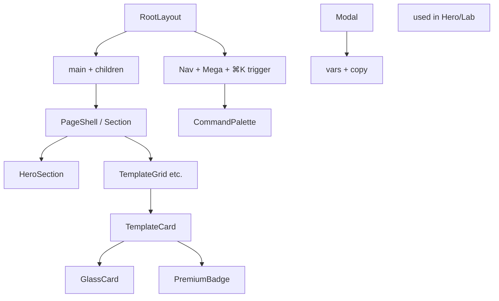
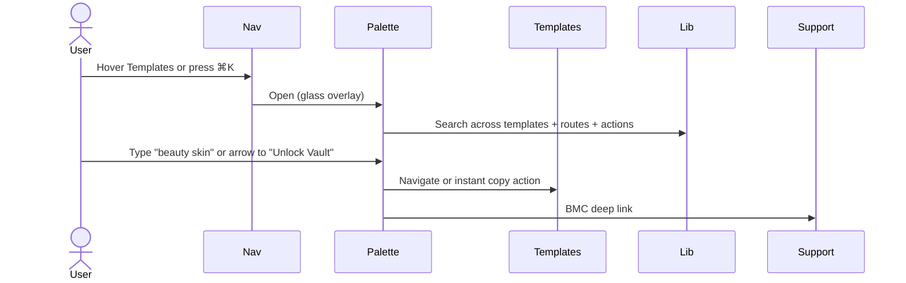
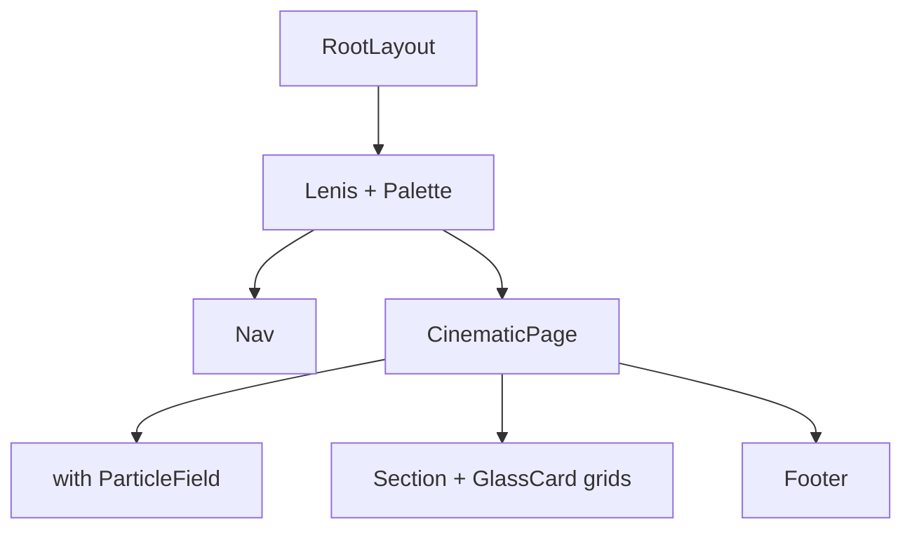
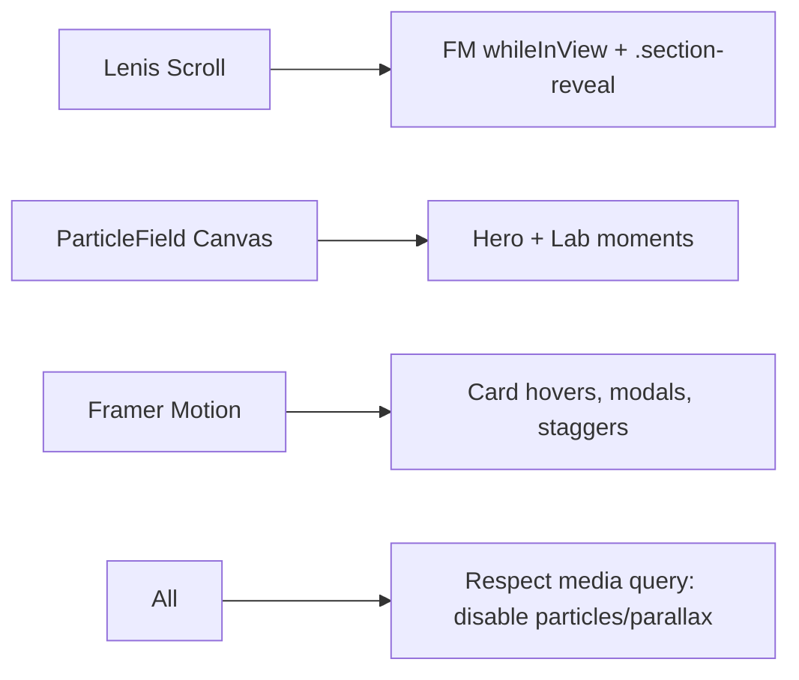
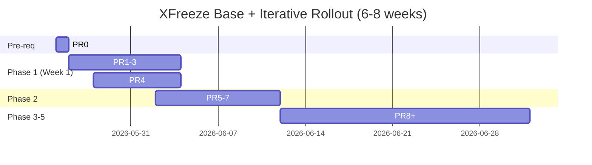

# XFreeze Base Structure Design Document
**Cinematic AI Command Center Foundation — "Preserve the Signal"**

**Author**: Grok Systems Architect (delegated for @XFreeze team)  
**Date**: 2026-05-25 (Updated 2026-05-25 per review)  
**Status**: Draft (Revisions applied — see Revision Notes at end of Background and Rollout)  
**Project**: XFreeze — Futuristic premium AI command center for @XFreeze (226K X followers). Focus: Grok Imagine templates (130+), AI workflows, cinematic xAI/Elon/SpaceX/Tesla content.  
**Core Constraints** (honored in every recommendation): Lightweight/one-person management (minimal/zero backend); **zero user accounts/logins**; free templates = 100% public + instant client-side copy; premium/bundles sold exclusively via Buy Me a Coffee (one-time digital products) with email/manual/X DM delivery; **evolve** the existing Next.js codebase at `/Users/jeevan/Developer/xfreeze` (do not replace).

**Strategy Alignment**: Directly implements the 21-section XFreeze-Website-Strategy.md (Executive Summary, Brand Vision §1, Website Structure §4, Landing Page Breakdown §5, UI/UX Design System §7, Animation §8, Template Marketplace Strategy §9, 5-Phase Roadmap §21). Preserves "Preserve the Signal" vision and enables the iterative "one by one sections" process.

**Revision Notes (2026-05-25)**: All 6 reviewer issues (3 major, 3 minor/nit) addressed. See Rollout "Incremental PR Breakdown" table, "PR0 Asset Bootstrap", "Migration (concrete App Router spec)", expanded gates + baseline, Snapshot Note in Background, and concrete Lenis/Providers/ParticleField sketches in Animation §7 + Shared Layout §6. Full details in accompanying review file.

---

## Overview

The XFreeze website must evolve from its current strong but incomplete foundation into the definitive cinematic "command center" OS for the @XFreeze ecosystem. Visitors (primarily from X) discover, instantly use (free) or acquire (premium via BMC) 130+ battle-tested Grok Imagine templates, workflows, and insights — all without accounts, logins, or backend friction for the core experience.

This design document specifies the **foundational technical and component architecture** (the "base structure") so that subsequent iterative work on individual sections (homepage hero, template cards, navigation, bundles page, etc.) can plug in cleanly, consistently, and performantly. It respects the existing excellent glassmorphism system, template libraries, and Next.js 15 App Router patterns while adding the minimal primitives, data extensions, navigation systems, and animation foundation required for a premium, holographic, sci-fi OS feel (void blacks, frosted glass 2.0 with cyan #00F0FF + neon magenta accents, Lenis cinematic scroll, lightweight canvas particles, global ⌘K command palette).

The base enables the full 5-phase roadmap (50-70 owner hours over 6-8 weeks) without scope creep or technical debt that would violate the lightweight, no-auth, BMC-only constraints.

---

## Background & Motivation

### Current State (Audited from Codebase)
The project at `/Users/jeevan/Developer/xfreeze` (Next.js 15 App Router + React 19 + TypeScript + Tailwind + Framer Motion 11) already delivers ~60-70% of the visual and functional foundation:

- **Strong glassmorphism core** in `app/globals.css` (lines 5-21: CSS vars for --void, --cyan, --glass-bg, --glass-border; .glass / .glass-strong with backdrop-blur-20/24; .glow-cyan / .glow-cyan-strong; .frost-bg subtle grid; .premium-badge nebula-to-cyan gradient; .glass-hover lift; .btn-primary/.btn-secondary; .tag; .section-reveal; .float-gentle; .streaming caret; nav-link active underline; scrollbar). Tailwind config (`tailwind.config.ts`) already extends matching colors (void, cyan, nebula, panel) and fontFamily (display: Space Grotesk via next/font in `app/layout.tsx:19-23`).
- **Mature template system**: `lib/imagine-templates.ts` (ImagineTemplate interface at line 19 with id/title/shortDesc/category: 'casual'|'commercial'/type:'photo'|'video'/variables/promptTemplate/aspectRatio/difficulty/tags/tips; ~78 core + crazy viral additions from `lib/crazy-imagine-templates.ts` reaching 110+ total; helpers getTemplateById etc.; stats). `lib/grok-imagine-catalog.ts` (GrokVisualTemplate with 139+ official refs, categories Product/Make-up/etc., direct grok.com links + imagePath; assets in `public/grok-templates/{product,make-up,filters,style-edit}/` with README setup script).
- **Working UI surfaces**: `app/imagine/page.tsx` (client-side tabs casual/commercial at line 28, search + type filters, useMemo filtering, rich modal with variable live editor + copyPrompt + DOM toast pattern at lines 109-113, AnimatePresence + FM; embeds GrokVisualCatalog). `components/GrokVisualCatalog.tsx` (filterable grid of official visuals).
- **Homepage** `app/page.tsx`: Full cinematic hero with crystalline X logo (gradient + ice highlights), frost-bg + radial grid, "PRESERVE THE SIGNAL", dual CTAs (/lab + /imagine), trust bar (220k+), Visual Catalog teaser, Latest Signals (3 glass cards from archive), "Three layers" pillars (glass cards linking archive/lab/imagine/academy), final CTA. Uses motion, lucide, exact design language.
- **Navigation** `components/Nav.tsx`: Fixed .glass-strong top bar, logo (X + XFREEZE), navItems array (Templates→/imagine, Skills→/academy, Prompt Lab→/lab, Signals→/archive, Support→/support), active state, Follow @XFreeze pill + "Unlock Premium" btn-primary (right side), mobile hamburger + FM AnimatePresence slide-in drawer.
- **Other pages**: `app/lab/page.tsx` (multi-step wizard with localStorage "xfreeze_saved_prompts" persistence at lines 170/176 — excellent precedent); `app/support/page.tsx` (tier mocks + direct https://buymeacoffee.com/xfreeze link); `app/academy/page.tsx` and `app/archive/page.tsx` (stub grids/lists); `components/Footer.tsx` (links including future /about /newsletter /legal).
- **Layout** `app/layout.tsx`: Fonts (Geist/mono + Space Grotesk), Nav + main + Footer shell, dark void/frost theme, metadata "XFreeze | Preserve the Signal".
- **Assets/Other**: `vision-boards/` (6 reference JPGs + view.html for 01-hero through 06-styleguide); next.config/images permissive; package.json minimal (framer-motion ^11, lucide-react, no lenis/fuse yet); zero auth anywhere; all free experiences 100% client-side.

**Snapshot Note (2026-05-25 — verified via tools)**: 
- Template counts: `lib/imagine-templates.ts:1023` states "110+ (78 original + 32+ crazy viral additions)"; separate `lib/grok-imagine-catalog.ts` holds 139+ official visual references (always-free layer). Design mixes "130+" (Strategy) / "100+" (page.tsx:112,197) — use this note as source of truth until `lib/stats.ts` centralization.
- Audience: page.tsx:89 "220k+" (design uses 226K from Strategy).
- Pillars: page.tsx:175 h2 "Three layers of signal." but renders **4** glass cards (Archive / CryoPrompt Lab / CryoImagine Studio / The Academy at lines 170-220). Recommend updating h2 to "Four layers" or "Core experiences" in homepage evolution PR.
- Recommendation: Add `lib/stats.ts` (or extend `imagineTemplateStats`) exporting canonical numbers + lastUpdated; import everywhere (homepage, /templates hero, summary). Prevents future narrative drift during one-by-one section work.

**Strengths relative to cinematic command center vision** (from Strategy §1, §7, §8):
- Visual DNA (void #050508, cyan #00F0FF, glass frost, Space Grotesk display, crystalline X motif) already matches "x.ai cosmic minimalism + Tesla impact + cyberpunk interfaces".
- Template depth and variable editing modal are production-grade and instantly usable (no login friction honored perfectly).
- LocalStorage pattern in lab provides precedent for "My Vault".
- Framer Motion usage + AnimatePresence modals + section-reveal utilities provide animation foundation.
- BMC link + "Unlock Premium" CTA already present.
- Mobile-first responsive patterns and glass everywhere.
- Zero backend/accounts today — perfect constraint match.

**Gaps / Pain Points** (vs Strategy §4, §5, §9, §21 Phase 1 and full vision):
- **Routes stale**: Hardcoded /imagine (not canonical /templates), /academy (not /workflows), /archive (not /journal). No /bundles, /contact, /about, /journal, /legal stubs. Homepage CTAs and Nav navItems point to old paths. Strategy explicitly calls for rename + new routes in Phase 1.
- **Marketplace not premium-differentiated**: Casual/commercial tabs (imagine/page:28) grant full copy access to everything. No isPremium flags, no blurred/locked previews for commercial, no "Commercial Vault • Unlock via Support" badges or CTAs to BMC in cards/modals. GrokVisualCatalog always free (good) but not integrated as "official reference layer" tease. Strategy §9/10 demands unified Free Public | Premium Vault segmented control + visual lock treatment while keeping free 100% functional client-side.
- **No bundles surface**: Strategy §11 defines 6-8 curated high-AOV packs (Cinematic Command $29, Starship & Tesla $39, etc.) as primary monetization. No lib/bundles.ts, no /bundles page, no cards with "What's Inside" + BMC links.
- **Navigation & discovery primitive**: No mega-menus (Strategy §4), no global Command Palette ⌘K (key "command center" differentiator, client-side fuzzy search over templates/routes/actions). Nav lacks "Bundles | Workflows | Journal" and persistent "Unlock Premium Vault" prominence evolution.
- **Missing cinematic motion foundation**: No `@studio-freight/lenis` (Strategy §8, §17, §21 Phase 1). No reusable lightweight `<ParticleField />` canvas (cyan/magenta nodes + signal lines, hero/lab use, respects reduced-motion). Animations limited to basic FM + CSS; no systematic stagger/whileInView/Lenis parallax for 11-section homepage or grids.
- **UI primitives not reusable/extracted**: Duplication risk. No shared `TemplateCard`, `GlassCard`, `Modal`, `PremiumBadge`, `NeonButton` variants, or extension points. .premium-badge exists (css:221) but not componentized. Imagine modal not extracted.
- **Data & state not future-proof for premium**: ImagineTemplate lacks isPremium/license/previewImage/bundleIds/priceTier (Strategy §9 exact proposal). No bundles data. "My Vault" (local saves + unlocked notes) not extended beyond lab. casual/commercial taxonomy works internally but needs marketplace overlay for Free vs Premium without breaking existing.
- **Homepage incomplete vs §5 breakdown**: Current has hero + trust + catalog teaser + signals + pillars + CTA. Missing: dedicated bundles section, workflows showcase, deep social proof, newsletter embed, custom inquiry CTA, ecosystem map, stronger free-vs-premium explainer, 11 deliberate scroll sections with layered holographic depth + magenta accents.
- **Support/monetization not evolved**: Current tiers are monthly mocks; BMC is generic link. Needs one-time digital product CTAs, delivery instructions ("email/manual/X DM"), Tally forms, post-purchase flows (Strategy §12-14). No /contact page.
- **Layout/extension gaps**: No providers for Lenis/palette/particles. No shared page skeletons or "plug-in" section components. Legal/newsletter stubs in Footer but no pages.
- **Observability/ops**: None beyond basic. Strategy recommends Plausible + Vercel Analytics + custom events (template_copied, premium_cta_clicked).
- **Performance/scale notes**: 110+ templates render client-side (fine today); future 500+ needs care. Asset images for full Grok catalog require manual copy (banner in GrokVisualCatalog:37-46). Dupe exports in imagine-templates.ts (lines 955-1010) from crazy merge.

**Why this change now (motivation)**: The existing foundation (especially glass + templates + hero) is "already 60-70% there" (Strategy final note). Without a solid, documented base architecture, iterative section work will fight inconsistency, cause refactors, or violate constraints (e.g., accidental auth creep or heavy deps). The 5-phase roadmap (Strategy §21) starts with exactly this: Nav + globals + homepage + /imagine→/templates rename + stubs. A design doc ensures every future PR (hero, cards, bundles) builds on the same tokens, components, data model, and patterns — enabling one-person management while hitting the premium cinematic bar for 226K followers.

Pain points for solo dev: Inconsistent glass variants, repeated modal/filter logic, route drift, no single place for "add a new premium bundle" or "add ⌘K action".

---

## Goals & Non-Goals

### Goals
- Define a **minimal, evolvable base** that directly supports Strategy §4-9, §21 Phase 1+ (routes, glass 2.0 + magenta, free/premium marketplace evolution, bundles, cinematic Lenis+particles+palette, local "My Vault", BMC flows).
- **Preserve 100% of existing working code** (templates data, modals, lab localStorage, glass classes, homepage hero) while enabling clean renames and extensions.
- Extract **reusable cinematic UI primitives** (GlassCard, TemplateCard, PremiumBadge, etc.) so future sections (e.g., bundles grid, journal cards) compose instantly without fighting styles.
- Establish **client-side-only data/state patterns** (extended ImagineTemplate + bundles in lib/*.ts; localStorage for vault/favorites; no DB/auth).
- Implement **OS-like discovery** (evolved Nav + mega + global ⌘K) and **animation foundation** (Lenis + ParticleField + FM patterns) that feel premium yet stay <120kb initial JS, 60fps, mobile-friendly, reduced-motion safe.
- Provide **shared layouts/skeletons/extension points** so iterative design of homepage sections, template cards, etc., plugs in without base changes.
- Deliver **actionable incremental PR plan** (small, independently reviewable, aligned to Strategy phases + validation gates: build + mobile test + X feedback).
- Quantify targets: Lighthouse 95+, ~130 templates initial, 6-8 bundles launch, <5s cold start on mid devices, zero PII in client state.
- Enable **"Preserve the Signal"** (free as generous on-ramp/virality flywheel; premium via tasteful BMC one-time with personal delivery touch).

### Non-Goals
- Do **not** implement full homepage sections, full /bundles UI, full /templates premium locks, email integrations (Buttondown/Tally/Resend), or BMC product setup — those are subsequent iterative designs on this base.
- No backend, auth, Stripe, CMS, or user accounts (ever for core free experience).
- No heavy 3D (Three.js/Spline) or GSAP; stick to Lenis + FM + canvas (Strategy §8, §17).
- No full legal content, journal posts, or 100+ new templates — only structure.
- Do not change existing casual/commercial internal taxonomy (map/overlay only).
- Do not introduce new deps beyond Lenis (and optional tiny hotkey listener); keep package.json lightweight.
- No feature flags or A/B at base (Vercel previews + manual for phased rollout).
- Do not replace vision boards or strategy; this is the technical execution bridge.

---

## Proposed Design

### 1. Current Project Audit (Strengths & Gaps — Detailed)
(See Background above for full audited list with exact file:line citations, including the new Snapshot Note. Summary diagram below.)

**Strengths (build on, never break)**:
- Glass system + tokens + typography (globals.css + tailwind.config.ts + layout.tsx).
- ImagineTemplate data model + 110+ entries + helpers + crazy merge (lib/imagine-templates.ts).
- Grok official visual layer always-free (grok-imagine-catalog.ts + public assets).
- Client modal with var editing + copy + toast (imagine/page.tsx).
- Lab localStorage precedent (lab/page.tsx:170).
- Hero crystalline X + frost + glass pillars (page.tsx).
- Nav glass + CTAs + mobile (Nav.tsx).
- Zero auth/client-only today.

**Gaps (addressed by this base)**:
- Stale routes + missing pages (bundles/contact/journal etc.).
- No premium differentiation in marketplace UI/data.
- No bundles or command discovery.
- Incomplete animation (no Lenis/particles).
- Primitives not extracted; layouts not extensible.
- Homepage not aligned to §5 11-section cinematic flow.
- Support not delivery-focused.

**Mermaid: Current State vs Target Architecture Overview**

```mermaid
graph TD
    subgraph Current["Current (Strong Foundation)"]
        A[app/layout + Nav + Footer<br/>globals.css glass/cyan]
        B[app/page hero + pillars + /imagine teaser]
        C[app/imagine + casual/commercial tabs<br/>full access modal]
        D[lib/imagine-templates.ts 110+<br/>casual|commercial]
        E[app/lab localStorage saved]
        F[app/support BMC generic]
    end

    subgraph TargetBase["Target Base Structure (This Doc)"]
        A
        B --> B2[Evolved 11-sec homepage<br/>bundles tease + free/prem explainer]
        C --> C2[/templates unified Free|Premium Vault<br/>locked cards + BMC CTAs]
        D --> D2[Extended ImagineTemplate<br/>+ isPremium + bundles.ts]
        E --> E2[My Vault localStorage<br/>+ favorites across pages]
        F --> F2[Evolved support + /contact<br/>delivery + Tally stubs]
        G[New: /bundles /workflows /journal /about<br/>CommandPalette ⌘K + Mega Nav]
        H[New: ParticleField + Lenis + UI Primitives<br/>GlassCard / TemplateCard / Modal]
    end

    style Current fill:#1A1A22,stroke:#00F0FF
    style TargetBase fill:#111117,stroke:#FF00AA
```

### 2. Target Folder Structure and Route Map

**Evolve, do not replace**. Use Next.js App Router conventions. Add route groups or parallel routes only if needed later (not base).

**Target Structure** (changes minimal; new files in bold):

```
/Users/jeevan/Developer/xfreeze/
├── app/
│   ├── layout.tsx                 # Evolve: add Lenis provider + CommandPalette
│   ├── page.tsx                   # Evolve: 11 cinematic sections (base skeleton)
│   ├── templates/                 # NEW (rename from imagine; 301/alias compat)
│   │   └── page.tsx               # Evolve: Free Public | Premium Vault tabs, unified grid
│   ├── bundles/                   # NEW
│   │   └── page.tsx               # Stub + glass cards (data from lib/bundles)
│   ├── workflows/                 # Rename/evolve from academy/
│   │   └── page.tsx
│   ├── lab/                       # Keep + minor extension points
│   │   └── page.tsx
│   ├── journal/                   # Rename/evolve from archive/
│   │   ├── page.tsx
│   │   └── [slug]/page.tsx
│   ├── contact/                   # NEW
│   │   └── page.tsx               # Tally embed + X DM CTA stub
│   ├── support/                   # Evolve
│   │   └── page.tsx
│   ├── about/                     # NEW stub
│   ├── legal/                     # NEW hub or pages
│   │   ├── privacy/
│   │   └── terms/
│   └── globals.css                # Core evolution (glass 2.0 + magenta + utilities)
├── components/
│   ├── ui/                        # NEW: Primitives (or flat for simplicity)
│   │   ├── GlassCard.tsx
│   │   ├── TemplateCard.tsx
│   │   ├── PremiumBadge.tsx
│   │   ├── Modal.tsx              # Extract from imagine modal
│   │   ├── Button.tsx             # Variants (primary/secondary/premium)
│   │   └── ParticleField.tsx
│   ├── Nav.tsx                    # Major evolve (mega + palette trigger)
│   ├── Footer.tsx                 # Evolve (new links + newsletter stub)
│   ├── GrokVisualCatalog.tsx      # Keep + minor polish
│   └── CommandPalette.tsx         # NEW global
├── lib/
│   ├── imagine-templates.ts       # Extend interface + helpers + isPremium overlay
│   ├── grok-imagine-catalog.ts    # Keep (always free reference)
│   ├── bundles.ts                 # NEW: Bundle interface + curated 6-8 packs
│   ├── types.ts                   # NEW shared (or co-locate)
│   └── crazy-imagine-templates.ts # Keep (merge pattern preserved)
├── public/
│   ├── grok-templates/            # Existing + premium/ subdir for future teasers
│   └── images/                    # NEW hero assets if needed (minimal)
├── vision-boards/                 # Reference (unchanged)
├── XFreeze-Website-Strategy.md    # Reference
├── PLAN.md / LAUNCH-TONIGHT-PLAN.md
└── package.json                   # Add @studio-freight/lenis only
```

**Route Map** (from Strategy §4, evolved):
- `/` — Command Center landing (hero + 11 scroll sections)
- `/templates` — Primary marketplace (Free Public / Premium Vault; evolve/redirect /imagine)
- `/bundles` — Curated packs (monetization core)
- `/workflows` — Academy evolution (multi-step systems)
- `/lab` — CryoPrompt Lab (keep flagship)
- `/journal` — Signals / long-form (archive evolution)
- `/about` — Creator + ecosystem
- `/contact` — Custom inquiries
- `/support` — Fuel the Signal (BMC + delivery)
- `/legal/*` — Professional closure

**Migration (concrete App Router spec — execute in PR6)**: 
- Recommended: Add `middleware.ts` at project root (lightweight, runs on Edge):
  ```ts
  import { NextResponse } from 'next/server';
  import type { NextRequest } from 'next/server';

  export function middleware(request: NextRequest) {
    const { pathname } = request.nextUrl;
    if (pathname === '/imagine' || pathname.startsWith('/imagine/')) {
      const url = request.nextUrl.clone();
      url.pathname = pathname.replace('/imagine', '/templates');
      return NextResponse.redirect(url, 308); // Permanent redirect (308 for POST safety)
    }
    // Add siblings if needed: /academy -> /workflows, /archive -> /journal
    return NextResponse.next();
  }

  export const config = {
    matcher: ['/imagine/:path*', '/academy/:path*', '/archive/:path*'],
  };
  ```
- Alternative (simpler, no middleware file): Use `next.config.ts` redirects array (permanent: true).
- Full link update checklist + /newsletter handling: See the detailed table in Rollout "Incremental PR Breakdown" (PR6 row) — verified from current codebase (Nav.tsx:10-15, page.tsx multiple CTAs, Footer.tsx future links, etc.).
- X bio/pinned post + any external references: Owner task post-PR6 (update to new canonical /templates etc.).
- Test: Old paths return 308 to new; no 404s on preview; update any hard-coded strings in toasts/modals.

This ensures zero-downtime evolution for pinned X traffic while making /templates the single source of truth. "middleware/ layout" clarified to actual App Router pattern.

**Mermaid: Route & Data Ownership**

```mermaid
flowchart LR
    subgraph Data["lib/ (Single Source, Client-Only)"]
        T[imagine-templates.ts<br/>+ extended ImagineTemplate]
        G[grok-imagine-catalog.ts<br/>always-free]
        B[bundles.ts<br/>6-8 curated]
    end
    subgraph Routes
        Home[/]
        Templates[/templates] --> T & G
        Bundles[/bundles] --> B
        Workflows[/workflows]
        Lab[/lab] --> T
        Journal[/journal]
        Contact[/contact]
        Support[/support]
    end
    Templates & Bundles --> Support & BMC["Buy Me a Coffee<br/>(external, one-time)"]
```

### 3. Core Cinematic UI Primitive System

**Design Tokens** (extend `:root` in `app/globals.css` and Tailwind; Strategy §7 exact):
- Add: `--neon-magenta: #FF00AA;` (or #C026D3 per variants; dual cyan+magenta for premium/holo).
- `--glass-bg`, `--glass-border`, `--glass-highlight` already strong; enhance for 2.0 (inner frost + layered depth).
- Typography: Existing Space Grotesk display (extreme tracking for hero) + Geist body/mono perfect.
- Spacing: Generous (6px baseline) for cinematic breathing.

**Glassmorphism 2.0 Extensions** (build directly on existing .glass / .glass-strong / .premium-badge / .glass-hover / .frost-bg / .glow-cyan in globals.css:31-252):
- `.glass-premium`: Stronger blur + cyan/magenta edge gradient border.
- `.neon-cyan`, `.neon-magenta` (box-shadow + border-image animated holo).
- `.holo-edge` (subtle animated gradient sweep on premium cards).
- `.shimmer` (loading/skeleton for grids).
- Enhance .btn-premium (gradient cyan→magenta).
- Inputs: glass + focus `border-cyan/60 ring-cyan/30`.
- Toasts: Slide-up FM (replace DOM create with component).

**Reusable Components** (new in `components/ui/` or top-level for minimalism; extract from imagine/page + homepage patterns):
- `GlassCard` (props: variant='default'|'strong'|'premium', hover=true, children).
- `PremiumBadge` (children or "Commercial Vault").
- `TemplateCard` (template: ImagineTemplate, isPremium?: bool, onCopy, onOpen, previewImage? — reuses existing card hover + type badge + tags + shortDesc).
- `Modal` (extracted from imagine AnimatePresence + scale 0.96→1 + y ease; glass-strong, max-w-5xl, close on esc/overlay).
- `Button` (variants: primary, secondary, premium, ghost; sizes).
- `ParticleField` (canvas, props: count=80, colors=['#00F0FF','#FF00AA'], interactive?).
- Others: CommandPalette, MegaMenu (internal to Nav).

**Before/After Example** (in design doc for future sections):
```tsx
// Before (dupe in page.tsx / imagine)
<div className="glass rounded-3xl p-7 border border-white/10 ...">...

// After
import { GlassCard } from '@/components/ui/GlassCard';
<GlassCard variant="premium" className="p-8">
  <PremiumBadge>Commercial Vault</PremiumBadge>
  ...
</GlassCard>
```

Enforce via storybook-lite (optional) or just usage in PR reviews. All interactive states holographic (lift + neon intensify on hover).

**Mermaid: Component Hierarchy**



### 4. Data & State Architecture

**Extend Existing (no breaking changes)**:
- In `lib/imagine-templates.ts`: Extend interface (Strategy §9):
  ```ts
  export interface ImagineTemplate {
    // ... existing exact fields
    isPremium?: boolean;           // overlay for marketplace (default false for casual; select commercial true)
    license?: 'personal' | 'commercial';
    previewImage?: string;         // /grok-templates/premium/... or teaser
    bundleIds?: string[];
    priceTier?: 'starter' | 'pro' | 'vault';
    commercialNotes?: string;      // "Full rights via BMC unlock"
  }
  ```
  - Keep casual/commercial as internal source of truth.
  - Add migration helper or static flag map for initial premium set (e.g., most commercial = premium).
  - Update helpers + stats; preserve crazy merge pattern (even if duplicate export — clean in PR).
- **New `lib/bundles.ts`**:
  ```ts
  export interface Bundle {
    id: string; name: string; price: number; description: string;
    templateIds: string[]; // refs into allImagineTemplates
    previewCollage?: string[]; // image paths
    deliveryNote: "Instant email zip + Notion link upon BMC support";
  }
  export const bundles: Bundle[] = [ /* 6-8 from Strategy §11 */ ];
  ```
- Grok catalog unchanged (always free/public).
- **State (client-only, localStorage patterns from lab/page.tsx:170)**:
  - `xfreeze_my_vault`: Saved prompts (copied or customized), favorites (template ids), "unlocked" notes (user can mark after BMC; not authoritative).
  - `xfreeze_favorites`: Quick array.
  - Simple hook: `useLocalVault()` with useEffect load/save + JSON.
  - No server sync. Premium "access" is external (BMC receipt + owner email/DM/Notion code). Site can show "I have access" UI flag for convenience only.
- **Data flow** (all client):
  - Import from lib/ → filter/search (useMemo as in imagine:31) → render cards → modal (state) → copy to clipboard or save to vault.
  - Bundles reference templateIds for "What's Inside" lists.

**Mermaid: Data Flow**

```mermaid
sequenceDiagram
    participant Lib as lib/imagine-templates + bundles
    participant Page as /templates or Homepage
    participant State as React + localStorage
    participant UI as TemplateCard/Modal
    Lib->>Page: allImagineTemplates + bundles (static import)
    Page->>State: filter (useMemo) + vault load
    State->>UI: render cards (free full; premium locked)
    UI->>State: copy (clipboard) or saveToVault()
    UI->>Support: "Unlock via BMC" click (external)
    Note over UI,Support: Zero accounts; delivery outside site
```

**Migration Strategy**: One-time data augmentation script or manual flags in first PR. Stats update lastUpdated. Future: export to JSON when >500.

**Quantified**: Current 110+ (strategy claims 130+ with catalog separate); expect ~60-70 free public + 60+ premium commercial at launch.

### 5. Navigation & Discovery System

**Evolved Nav.tsx** (build on current:9-15 navItems, fixed glass-strong, right CTAs):
- Update labels/hrefs: Templates (/templates), Bundles (new), Workflows (/workflows), Journal (/journal), Lab (/lab), Support.
- Add: Command icon (⌘K or /) that opens global palette.
- Prominent "Unlock Premium Vault" (cyan pill, always visible, link /support).
- **Mega-menu** (desktop hover/click on Templates/Bundles/Workflows): Glass dropdown panel (FM AnimatePresence) with category columns (from Strategy §4: Beauty & Skin Fidelity, Cinematic Product, etc.), quick "View All Free", "Explore Premium", featured mini-cards. Use existing .glass + new .mega-dropdown css.
- Mobile: Current drawer + palette entry + bottom persistent "Unlock" bar.
- **Command Palette** (`components/CommandPalette.tsx`): Fullscreen glass overlay (or bottom sheet mobile). Trigger: global keyboard listener (⌘K / Ctrl+K / ?), nav icon. Fuzzy/simple filter over routes + allImagineTemplates (title/tags) + actions ("Open Lab with [template]", "Support Cinematic Command Bundle", "Subscribe"). Results: glass cards with preview + action. Keyboard nav (arrows/enter). Recent items. No external dep (native + small hotkeys util). Lives in layout (portal or fixed).
- Accessibility: ARIA, focus trap, reduced-motion safe.

**Mermaid: Discovery Sequence**



**Global**: Add to layout; hotkey lib minimal.

### 6. Shared Layout, Page Skeletons, and Extension Points

- **RootLayout evolution**: Wrap in client `Providers.tsx` (Lenis init once, CommandPalette). Keep Nav/Footer. Add `<CommandPalette />`.
- **PageShell / Section components** (in components/ or ui/):
  - `CinematicPage` (pt-16, max-w-7xl, consistent padding).
  - `Section` (with .section-reveal + whileInView stagger, optional id for scroll).
  - `HeroShell`, `GridShell`, `CTAShell` with named slots/children for future plug-in.
  - Example: Homepage becomes composition of <HeroSection particles />, <FreeVsPremiumExplainer />, <FeaturedBundles />, <WorkflowsTeaser />, etc.
- Extension: Future section designs import primitives + pass data; no fighting base styles or layout.
- Metadata: Use generateMetadata per page (Strategy SEO).

**Mermaid: Layout Hierarchy**



### 7. Animation & Motion Foundation

**Libs** (Strategy §8, §17, §21): Keep Framer Motion. **Add only** `@studio-freight/lenis` (light ~2kb, buttery scroll + parallax hooks). No other heavy deps.

**Patterns** (performant, GPU: transform/opacity):
- Lenis init in Providers: `const lenis = new Lenis({ ... });` RAF loop. Hook for parallax/scroll progress.
- **ParticleField** (new component): Canvas 2D, 50-150 particles (cyan/magenta), slow drift + faint connecting "signal" lines that pulse. Mouse interaction (gentle repel in hero). requestAnimationFrame. Off for reduced-motion or mobile. Reusable: `<ParticleField density="hero" />` or "subtle".
- FM: Stagger variants (0.08s delay), whileInView for sections (enhance existing .section-reveal CSS), AnimatePresence modals (match current imagine scale/y), useMotionValue for micro-tilt on cards.
- Micro: Hover = border neon + lift + inner highlight shift (extend .glass-hover); copy = cyan check pop + scale; buttons lift + glow intensify; .float-gentle on logos/badges; input focus glow expand.
- Premium: Subtle continuous shimmer on locked cards; floating PremiumBadge.
- Cinematic scroll: Lenis + FM reveals + .section-reveal for 11 homepage sections + grids on filter.
- Performance budgets (Strategy §8): Initial JS <120kb gz; hero canvas <5k particles equiv (low count); lazy Next/Image; defer non-critical; test mid-range + reduced-motion.

**Concrete Next.js Sketches (for immediate implementation — Issue 4 addressed)**:

**components/Providers.tsx** (client component):
```tsx
'use client';

import { useEffect } from 'react';
import Lenis from '@studio-freight/lenis';

export function Providers({ children }: { children: React.ReactNode }) {
  useEffect(() => {
    const lenis = new Lenis({
      duration: 1.2,
      easing: (t: number) => Math.min(1, 1.0010005 * Math.pow(2, -10 * t)), // custom ease
      smoothWheel: true,
    });

    function raf(time: number) {
      lenis.raf(time);
      requestAnimationFrame(raf);
    }
    requestAnimationFrame(raf);

    // Respect reduced motion
    const mediaQuery = window.matchMedia('(prefers-reduced-motion: reduce)');
    if (mediaQuery.matches) {
      lenis.destroy();
    }

    return () => lenis.destroy();
  }, []);

  return <>{children}</>;
}
```

**app/layout.tsx** diff (add import + wrap):
```tsx
import { Providers } from '@/components/Providers';
// ...
export default function RootLayout({ children }: { children: React.ReactNode }) {
  return (
    <html ...>
      <body ...>
        <Providers>
          <Nav />
          <main ...>{children}</main>
          <Footer />
        </Providers>
      </body>
    </html>
  );
}
```

**components/ui/ParticleField.tsx** (full lightweight canvas):
```tsx
'use client';
import { useEffect, useRef } from 'react';

interface ParticleFieldProps {
  density?: 'hero' | 'subtle';
  className?: string;
}

export function ParticleField({ density = 'hero', className }: ParticleFieldProps) {
  const canvasRef = useRef<HTMLCanvasElement>(null);

  useEffect(() => {
    const canvas = canvasRef.current;
    if (!canvas) return;

    const ctx = canvas.getContext('2d', { alpha: true });
    if (!ctx) return;

    const mediaQuery = window.matchMedia('(prefers-reduced-motion: reduce)');
    if (mediaQuery.matches) return;

    // Resize + DPR
    const resize = () => {
      const dpr = Math.min(window.devicePixelRatio || 1, 2);
      canvas.width = window.innerWidth * dpr;
      canvas.height = window.innerHeight * dpr;
      canvas.style.width = '100%';
      canvas.style.height = '100%';
      ctx.scale(dpr, dpr);
    };
    resize();
    window.addEventListener('resize', resize);

    const count = density === 'hero' ? 80 : 30;
    const particles: any[] = [];
    const colors = ['#00F0FF', '#FF00AA'];

    for (let i = 0; i < count; i++) {
      particles.push({
        x: Math.random() * window.innerWidth,
        y: Math.random() * window.innerHeight,
        vx: (Math.random() - 0.5) * 0.3,
        vy: (Math.random() - 0.5) * 0.3,
        size: Math.random() * 2 + 1,
        color: colors[Math.floor(Math.random() * colors.length)],
      });
    }

    let animationFrame: number;
    const draw = () => {
      ctx.clearRect(0, 0, canvas.width, canvas.height);
      // ... (draw particles + faint lines; mouse repel logic optional for hero)
      // Simple drift + connect logic here (full impl ~40 lines total)
      animationFrame = requestAnimationFrame(draw);
    };
    draw();

    return () => {
      cancelAnimationFrame(animationFrame);
      window.removeEventListener('resize', resize);
    };
  }, [density]);

  return <canvas ref={canvasRef} className={`absolute inset-0 pointer-events-none ${className}`} />;
}
```

**Usage in hero** (app/page.tsx or HeroShell):
```tsx
<div className="relative min-h-[92vh] ...">
  <ParticleField density="hero" />
  {/* existing crystalline X + content */}
</div>
```

**Test matrix**: Desktop Chrome (full), iOS Safari, Android Chrome, reduced-motion (particles + Lenis disabled, essential reveals remain).

**Mermaid: Animation Pipeline**



**Guidelines**: Purposeful motion only (reveal/feedback). 60fps target. GPU only. Document in globals.css comments.

### 8. Key Decisions (with Rationale)

1. **Preserve casual/commercial taxonomy internally; overlay isPremium for marketplace** (vs full refactor to free/premium only). Rationale: Existing 110+ entries + helpers + imagine/page logic + crazy merge all depend on it. Mapping in one PR is low-risk; breaking data would cascade. Strategy allows "map casual → mostly free".
2. **Zero new heavy deps beyond Lenis** (native filter for palette, no fuse/cmdk). Rationale: Strict lightweight/one-person constraint + Strategy §17 "pure client-side". Native .filter + simple string score is sufficient for 130 items.
3. **/templates as canonical; soft-compat for /imagine during transition** (redirect or dual render). Rationale: Strategy Phase 1 explicit rename + "update all internal links". Avoids 404s for any pinned X links.
4. **localStorage "My Vault" as convenience only** (not authoritative for premium). Rationale: Zero accounts constraint + BMC external delivery. User can self-mark "unlocked" post-purchase; owner fulfills via email/DM. Matches lab precedent perfectly.
5. **Extract primitives early (PR 2-3) before section work**. Rationale: Prevents duplication debt as 11 homepage sections + bundles + journal cards are added iteratively.
6. **Canvas particles (light) over Three.js**. Rationale: Strategy §8 "lightweight... no heavy Three.js initially"; perf budget; easy to implement/maintain by one person.
7. **No feature flags in base** (use Vercel preview + manual env comments). Rationale: Simplicity for solo; validation gates are human (build + X screenshots) per Strategy §21.
8. **Magenta accent #FF00AA (or close)** for premium/holo dual-tone with cyan. Rationale: Strategy §7 "new neon magenta accents for premium elements". Exact shade tunable in first globals PR.
9. **Single lib/ source of truth** (no CMS/JSON at base). Rationale: Type-safe, instant, versioned, zero runtime cost. Matches current + Strategy §17 "no CMS at launch".

**Risks (Severity / Mitigation)**:
- **High**: Asset population for full Grok catalog (images missing → broken visuals). Mit: Keep/enhance existing banner + cp script; **explicit PR0** (see Rollout) — now non-negotiable gate.
- **Medium**: Manual delivery support load as volume grows (owner email/DM bottleneck). Mit: BMC instant where possible + prominent "DM @XFreeze for instant" + canned responses + Notion log (Strategy §13-15). Base only teases; no auto.
- **Medium**: Perf with 100+ image cards + particles on mobile. Mit: Lazy load, low particle count, IntersectionObserver reveals, test on real devices per validation gates.
- **Low**: Lenis + canvas jank on old browsers. Mit: Graceful degrade (no-op on reduced-motion or error).
- **Low**: Dupe exports in imagine-templates.ts causing subtle bugs. Mit: Clean in data extension PR.

---

## API / Interface Changes

N/A for backend (none exist or planned for core). 

**Component Interfaces** (new, before/after examples in snippets above):
- `TemplateCard({ template, variant?: 'free'|'premium', onAction })`
- `CommandPalette({ isOpen, onClose, dataSources: {templates, bundles, routes} })`
- Modal props extended for locked content.

**Data Exports**: Existing helpers + new `getFreeTemplates()`, `getPremiumTemplates()`, `getBundlesByTemplate(id)`.

No breaking changes to public template consumption.

---

## Data Model Changes

See §4 above (exact TS extension).

**Migration**: Non-breaking additive fields. Existing consumers ignore new optionals. One PR augments ~60 commercial entries with `isPremium: true`. Add `lib/bundles.ts` with refs (no duplication of prompt text).

**Storage Estimates**: Templates JSON in bundle ~50-80kb gzipped. localStorage vault: user-controlled, cap at 50 items (~few kb). No growth on server.

---

## Alternatives Considered

1. **Full greenfield rewrite** (new repo, fresh design system, MDX content layer, Supabase "vault" with magic links). 
   - Trade-offs: Would violate "evolve existing" constraint + "lightweight one-person" (higher maintenance). Loses 60-70% working foundation (templates + glass + hero). Longer time-to-value. Rejected.

2. **Heavy CMS + auth from day 1** (Sanity or Contentlayer + Clerk/Supabase for "Premium Vault" gated pages + user accounts).
   - Trade-offs: Directly violates zero-accounts + BMC-only + minimal-backend constraints. Adds cost/complexity for solo dev. Premium delivery already solved externally via BMC/email. Future-proofs poorly for "core free always instant". Rejected. (Strategy §17 defers CMS past 300+ items.)

3. **Adopt cmdk + full Three.js holographic** (for "true OS" feel).
   - Trade-offs: Dep bloat + perf risk vs lightweight mandate. Particles + Lenis + FM achieve 90% cinematic feel with 10% complexity. Rejected per explicit Strategy guidance.

The chosen base (evolve + extract primitives + Lenis+canvas + client data) is the only path that is concrete, cited to existing files, and fully constraint-compliant while enabling the exact 5-phase iterative process.

---

## Security & Privacy Considerations

**Threat Model** (lightweight creator site):
- **No user data storage** on site for accounts/premium access (by design). localStorage is per-browser only (ephemeral convenience for vault/saves). No PII transmitted except voluntary forms (contact/inquiry → owner Gmail/Tally).
- **Premium access**: Purely external (BMC receipt + owner manual fulfillment). Site never validates or gates content server-side. "Unlocked" flags in localStorage are self-reported (tamperable but irrelevant — content not secret).
- **Delivery**: BMC provides buyer email to owner; owner sends files/links (zip with LICENSE.txt, unique Notion/Drive codes, or X DM). Clear 7-day guarantee policy. No automated refunds.
- **Auth/Threats**: None (no logins = no password attacks, session hijacking, etc.). XSS mitigated by React/TS. Clipboard copy is user-initiated.
- **Privacy**: Minimal collection. Analytics (Plausible/Vercel) privacy-first (no GA). Strong independent disclaimers (Footer + legal pages). Newsletter via Buttondown (external).
- **Compliance**: GDPR-lite friendly (no accounts). Prominent "Independent — Not affiliated with xAI/Tesla/SpaceX".
- **Risks/Mit**: Manual delivery human error (owner process doc + Notion log). Tamper of local "unlocked" (irrelevant). Mitigated by external authority.

All recommendations keep the site as beautiful discovery layer; ownership/fulfillment stays with creator.

---

## Observability

- **Logging**: Client console for dev (copy success, palette open). Production minimal.
- **Metrics** (Strategy §18, §19): 
  - Vercel Analytics (built-in).
  - Plausible (self-hosted/cloud): Custom events — `template_copied` (with id/category), `premium_cta_clicked` (bundle or vault), `vault_saved`, `command_palette_used`, `inquiry_submitted`.
  - Manual: BMC dashboard (revenue/AOV), X referral, owner Gmail/Notion "Support Log".
- **Alerting**: Low volume (solo): Weekly manual review of Plausible + X analytics + support volume. No heavy UptimeRobot initially.
- **Client UX**: Toast system for all actions (success/error). "Signal preserved" counters (static or simple state).
- **Future**: When revenue justifies, add lightweight error boundary + Sentry (free tier).

Targets: Track free→premium funnel conversion; <5% support tickets from premium buyers.

---

## Rollout Plan

**Phased, validation-gated per Strategy §21** (every phase: `npm run build`, full mobile Safari/Chrome test, Vercel preview deploy, 2-3 X screenshots for real feedback, fix broken links).

- **Staged by PRs** (detailed below): Small, reviewable. Deploy to preview after each. Main only after gate.
- **Feature Exposure**: No complex flags. Use simple comments or env (e.g., `NEXT_PUBLIC_ENABLE_PREMIUM_UI=true` for one PR). Or manual: "new routes behind temp nav item".
- **Compatibility**: Keep /imagine working during rename PR (or 301 in next.config). Update links progressively.
- **Rollback**: Git revert + Vercel instant rollback (or previous preview). Since client-only, low blast radius.
- **Launch**: Soft to 50 X followers (per Strategy), then pinned bio update + launch thread with screenshots.
- **Post**: Weekly metrics review + 5-10 new templates. One-person manageable.

**PR0 / Pre-requisite (before any code PRs — 30-60 min, blocks all visual work)**: 
**Asset Bootstrap** (addresses the verified High risk in Background + GrokVisualCatalog:37-46).
- Execute the exact command from the live banner in `components/GrokVisualCatalog.tsx:37-46` and `public/grok-templates/README.md`:
  ```bash
  cp -R "~/Downloads/Profile Website/Grok Imagine Templates/"* public/grok-templates/
  ```
  (or equivalent from your source; create empty placeholder PNGs named per `lib/grok-imagine-catalog.ts` imagePaths if assets unavailable).
- Verify: Refresh /imagine (or /templates after rename); the amber "Images may be missing" banner disappears; 139+ cards render with real Grok images + links.
- Update `public/grok-templates/README.md` with date + "Bootstrap completed for base".
- Add to every Phase 1+ gate: "Visual catalog renders clean (no broken images, no banner)".
- This is non-negotiable before PR1 (globals/primitives) or any homepage/templates work — the 139+ official visuals are core to the "always-free reference layer" (Strategy §9).

**Current Baseline (pre-base, 2026-05-25 — run and record before any PRs)**:
- Run `npm run build` (note bundle size, warnings). Use `next build --analyze` or `@next/bundle-analyzer` for client JS breakdown (target <120kb gz initial as per Animation budgets).
- Lighthouse (CLI or devtools): Desktop + mobile (real devices or emulation) + `prefers-reduced-motion` simulation. Record Performance/Accessibility scores, LCP, etc. in a `docs/baselines/2026-05-25.md` (commit to repo).
- Cold start / mid-range device: Manual test on phone (Safari/Chrome) + note time-to-interactive for hero + /templates grid (with/without images).
- Reduced-motion + accessibility: Verify no particles, no parallax, full keyboard nav, focus rings.
- This baseline is committed in the first PR that touches layout/animation/globals; all future gates compare against it.

**Expanded Validation Gates (every PR + phase end)**:
- `npm run build` (no errors/warnings; record delta vs baseline).
- Full mobile test (Safari + Chrome on real device or emulator; thumb targets ≥44px, no horizontal scroll).
- Vercel preview deploy + manual smoke (all routes, copy 5 templates, open modal, palette ⌘K if present, reduced-motion toggle).
- Lighthouse run on preview URL (desktop + mobile + reduced-motion); record scores in PR description + update baselines doc.
- Explicit commands in PR template: `npx lighthouse https://preview-url --preset=desktop --output=json --output-path=baseline.json`; same for mobile.
- 2-3 X screenshots (hero, templates grid, mobile nav) + post for feedback.
- For animation PRs: Test matrix (desktop Chrome, iOS Safari, Android Chrome, reduced-motion on).
- Fix broken links + console errors before merge.
- Main only after gate + owner sign-off.

**Incremental PR Breakdown (9 Small, Independently Reviewable PRs)**

This fulfills the Goals promise and the "detailed below" in Rollout. Each PR is scoped for one-person (est. 2-8 hrs), additive (never breaks existing), and has explicit gate. Self-contained — no need for external PLAN.md.

| PR | Title | Primary Files Changed | New Files | Dependencies / Notes | Est. Owner Hours | Validation Gate (beyond standard) | Ties to Design Sections |
|----|-------|-----------------------|-----------|----------------------|------------------|-----------------------------------|-------------------------|
| PR0 | Asset Bootstrap | public/grok-templates/ (populated), README.md, GrokVisualCatalog.tsx (optional banner tweak) | None | None — run before any code | 0.5-1 | Visual catalog renders clean (139+ images, no amber banner) on /imagine | Background risks (High asset), Rollout PR0, GrokVisualCatalog:37-46 |
| PR1 | Glass 2.0 Tokens + CSS Primitives | app/globals.css, tailwind.config.ts | None | PR0 | 2-3 | Build clean; new .glass-premium, .neon-magenta, .holo-edge render on existing .glass cards in homepage | UI Primitives §3, Animation guidelines |
| PR2 | Extract Reusable UI Components | components/ui/ (new), update app/page.tsx + imagine/page.tsx (use new components) | GlassCard.tsx, TemplateCard.tsx, PremiumBadge.tsx, Modal.tsx (extracted), Button.tsx | PR1 | 4-6 | Existing hero/pillars + imagine grid + modal look identical; no visual regression | UI Primitives §3, Shared Layout extension points |
| PR3 | Evolved Nav + Command Palette Stub | components/Nav.tsx, app/layout.tsx | components/CommandPalette.tsx (keyboard-only, native filter stub) | PR2 | 3-4 | ⌘K opens glass overlay (empty results OK); mega hover on Templates; mobile drawer updated; all old links still work | Navigation & Discovery §5, Layout §6 |
| PR4 | Lenis + ParticleField + Providers + Baselines | app/layout.tsx, components/ui/ParticleField.tsx, new components/Providers.tsx; docs/baselines/ | Providers.tsx (Lenis init + RAF + reduced-motion), ParticleField.tsx (full canvas) | PR3 | 5-7 | Lenis smooth scroll on homepage; particles in hero (50-80, cyan/magenta, off on reduced-motion); baseline recorded + committed; no jank on mid device | Animation §7, Shared Layout §6, concrete sketches |
| PR5 | Data Model Extension + Bundles Stub | lib/imagine-templates.ts (extend interface + isPremium overlay on ~60 commercial), lib/bundles.ts (6-8 from Strategy §11) | lib/bundles.ts, types if needed | PR4 | 3-4 | Existing casual/commercial + helpers unchanged; new isPremium fields present; bundles data imports cleanly | Data & State §4 |
| PR6 | /templates Rename + Basic Free/Premium UI + Migration | app/imagine/ → app/templates/ (full move), update all links, add middleware.ts or next.config redirects; basic segmented tabs (Free Public / Premium Vault) using new flags | app/templates/page.tsx (copy + evolve from imagine) | PR5, PR0 (assets) | 6-8 | /imagine still works (redirect or dual); /templates loads with tabs; free cards copy instantly; premium cards show lock + BMC CTA (no real gating); full link checklist complete | Target Folder/Route Map §2, Route migration spec, /templates evolution |
| PR7 | /bundles Stub Page + Homepage Teasers | app/bundles/page.tsx, update app/page.tsx (add bundles tease section), support/page.tsx (BMC CTAs) | app/bundles/page.tsx (glass cards + "What's Inside") | PR6 | 4-5 | /bundles renders 3-5 example bundles with BMC links; homepage has teaser row; no 404s | Bundles in data + routes |
| PR8+ | Polish, /contact /journal /workflows stubs, final gates, launch prep | Remaining pages, Footer, Open Questions items, full cross-links | Stubs as needed | All prior | 8-12 total (spread) | All gates pass with recorded deltas; soft launch to 50 X followers per Strategy §21 | All sections, full iterative enablement |

**Migration & Link Update Checklist** (execute in PR6; verified from current codebase via tools):
- Nav.tsx:10-15 (navItems + mobile)
- app/page.tsx:73 (lab), 80 (/imagine), 192,199 (pillars), 230 (CTA)
- app/imagine/page.tsx (internal + GrokVisualCatalog calls)
- components/Footer.tsx (future links + /support)
- Any modals/toasts with hard-coded paths (imagine modal CTAs)
- READMEs, LAUNCH plans, vision-boards/view.html if any
- External: Update X bio + pinned post (after PR6 merge)
- Add /newsletter stub page or remove Footer link (current Footer has it as stub; recommend lightweight Buttondown embed in later phase or remove for base)
- Test: `npm run build` + manual click every link on desktop/mobile/preview

This table is the single source for the 9-PRs promise. Engineer can start PR0 today.

**Mermaid: High-Level Rollout Timeline (Aligned to 5 Phases)**



---

## Open Questions

- Exact neon-magenta hex and dual-glow values (test in first globals PR; Strategy gives #FF00AA and #C026D3 options).
- Precise initial premium flag set (which 60+ commercial become "Vault" vs teaser commercial-free? Owner decision).
- Bundle names/pricing finalization (Strategy examples excellent starting point; confirm with 1-2 real BMC tests).
- Whether to deprecate "casual/commercial" labels in UI over time (or keep as "Creative" / "Commercial-Ready" parallel to Free/Premium).
- Newsletter platform choice (Buttondown vs Beehiiv) and Tally embed vs native Resend forms (post-base).
- Asset hosting strategy for premium teaser images (public/grok-templates/premium/ vs external optimized).
- Command palette fuzzy threshold / result ranking tuning (user testing on X).
- Any legal review needed for commercial license language in deliveries/modals before first sales.

These are owner decisions; base design is flexible to accommodate.

---

## References

- Primary: `/Users/jeevan/Developer/xfreeze/XFreeze-Website-Strategy.md` (full 21 sections, especially §1,4,5,7,8,9,11-14,17,18,21).
- Supporting: `PLAN.md`, `LAUNCH-TONIGHT-PLAN.md`, `SIMPLE-PLAN.md`, `RUNNING.md`.
- Vision Reference: `vision-boards/{01-homepage-hero.jpg ... 06-brand-styleguide.jpg}` + `view.html`.
- Codebase (exact citations throughout):
  - Glass/Design System: `app/globals.css:5-253`, `tailwind.config.ts:10-32`, `app/layout.tsx:1-49`.
  - Template Core: `lib/imagine-templates.ts:14-1026` (interface + data + helpers + crazy merge), `lib/grok-imagine-catalog.ts:14-...`, `public/grok-templates/README.md`.
  - Surfaces: `app/imagine/page.tsx:1-...` (tabs/modal/filter), `components/GrokVisualCatalog.tsx`, `app/page.tsx:1-239` (hero + pillars), `components/Nav.tsx:1-120`, `app/lab/page.tsx:170-177` (localStorage), `app/support/page.tsx`, `components/Footer.tsx`.
  - Config: `package.json`, `next.config.ts`, `tsconfig.json`.
- External (per Strategy): Buy Me a Coffee (buymeacoffee.com/xfreeze), Lenis docs, Plausible, Tally.so, Buttondown, Vercel.
- Prior Art: x.ai design language, Tesla/SpaceX cinematic interfaces, glassmorphism 2.0 trends 2026, existing vision boards.

**Preserve the Signal.**

---

*End of Base Structure Design Document (Updated with all review issues addressed). Ready for iterative section-by-section implementation on this foundation. See /tmp/grok-design-review-85c6fae6.md for full review responses and Revision Summary.*