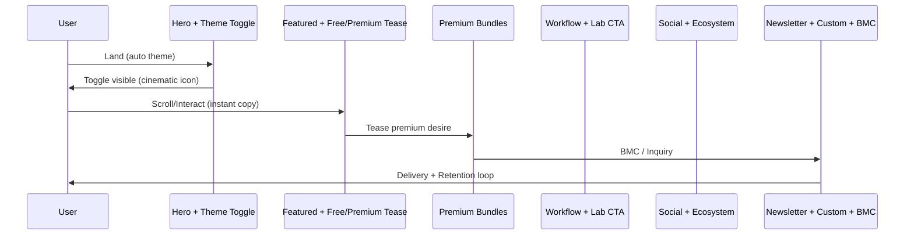
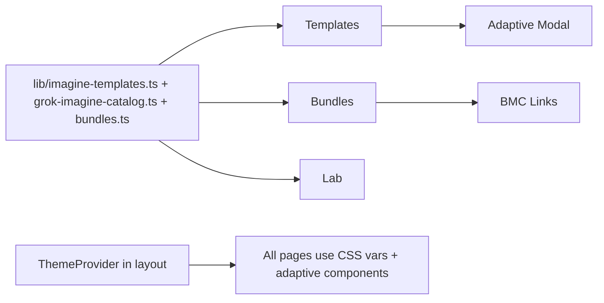
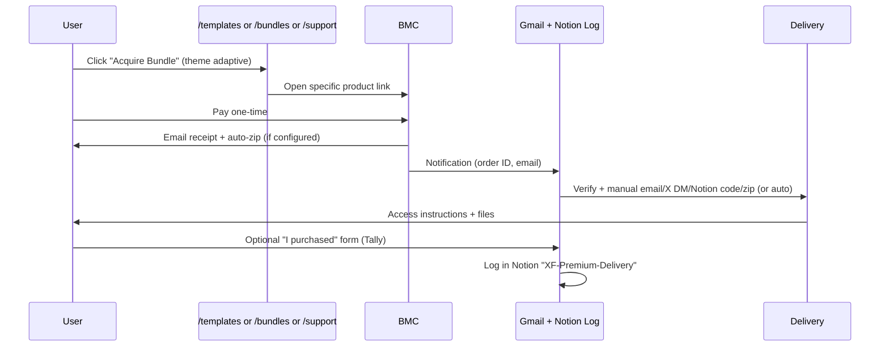

# XFreeze Website Strategy, Architecture, UI/UX System & Development Roadmap

**A Professional Cinematic Premium AI Command Center for the @XFreeze Ecosystem**  
**"Preserve the Signal" — Now with First-Class Dual Bright (Solar Command / Daybreak Protocol) + Dark (Void Protocol) Themes**

**Brand**: @XFreeze (226k+ blue-verified followers on X)  
**Core Offerings**: 130+ battle-tested Grok Imagine templates (free public + premium commercial), advanced AI workflows, cinematic prompt engineering, xAI/Elon/SpaceX/Tesla ecosystem signals  
**Assets**: 130+ templates organized across assets from `/Users/jeevan/Downloads/Profile Website/Grok Imagine Templates/` (Product with 64 images, style edit with 56, make-up/, Filters/ + Generated PDFs + All links.pdf) + existing public/grok-templates/ + vision-boards/  
**Current Foundation (Audited 2026-05-26)**: Next.js 15 App Router + TypeScript + Tailwind + Framer Motion + Lucide. Hardcoded dark-only (`app/layout.tsx:39` `<html className="dark">`, `app/globals.css` full :root dark vars + .glass/.glass-strong/.glow-cyan + .premium-badge + .frost-bg, `components/Nav.tsx` glass-strong fixed with stale routes /imagine /academy /archive, `lib/imagine-templates.ts` 78+ core entries + crazy viral push to ~110+, `lib/grok-imagine-catalog.ts` 57+ visual refs with direct grok.com links, `components/GrokVisualCatalog.tsx`, `app/page.tsx` cinematic hero + pillars + signals teaser, `app/imagine/page.tsx` client-side tabs/filters/modal/copy, `app/lab/page.tsx` localStorage "frozen prompts" precedent, `app/support/page.tsx` mock tiers + BMC, `app/globals.css:5-253` complete dark glass system, `tailwind.config.ts` static dark colors, `public/grok-templates/` (structure ready but images require bootstrap from `/Users/jeevan/Downloads/Profile Website/Grok Imagine Templates/`), vision-boards/ (6 cinematic references). No theme system, no /templates /bundles /contact /workflows /journal yet, Footer links to future pages.  
**Prior Strategy Evolved**: Builds directly on exhaustive `XFreeze-Website-Strategy.md` (full 21-section coverage, no-login/BMC/manual delivery, glass 2.0 cyan+magenta, command palette, Lenis, bundles, /templates evolution) + `docs/Base-Structure-Design.md` (post-review PR0-8 foundation with primitives, migration, particles) + `PLAN.md` / `LAUNCH-TONIGHT-PLAN.md`. **New unifying pillar**: Mandatory professional dual bright/dark themes as first-class citizen (non-negotiable per user requirement).  
**Author**: Grok Build Subagent — Senior Systems Architect + Futuristic Creative Director + AI Marketplace Strategist  
**Date**: 2026-05-26  
**Status**: Draft — Complete, actionable, production-ready for senior frontend engineer. Lightweight, no accounts, BMC-primary, client-side free core preserved and elevated.

---

**Critical Overarching Requirement (Honored in Every Section)**: The site must deliver a **PROFESSIONAL** experience in **BOTH bright (light) and dark themes**, controlled by a prominent, cinematic, futuristic icon/toggle. Bright/"Solar Command" or "Daybreak Protocol" mode must retain the full premium, sci-fi, holographic, xAI/SpaceX/Tesla-inspired cinematic feel — clean high-contrast holographic glass, professional bright frosts, adapted neon/cyan accents, subtle shadows instead of heavy dark glows, immersive and futuristic (never generic corporate light mode). Dark remains the signature "Void Protocol". Theme affects nav, hero, cards, glassmorphism adaptations, animations, modals, everything. Toggle is a signature brand element.

---

## 1. Brand Vision

The XFreeze Command Nexus is the definitive professional cinematic headquarters for the @XFreeze ecosystem — the calm, high-signal sanctuary where 226k+ X followers transition from real-time threads and Grok generations to owned, actionable mastery of elite prompt systems, 130+ Imagine templates, workflows, and the xAI/Elon/SpaceX/Tesla frontier. It embodies "**Preserve the Signal**": transforming ephemeral content into a permanent, premium AI operating system and creator hub.

**Core Positioning**: Professional showcase + frictionless marketplace (free public instant client-side + premium commercial one-time via Buy Me a Coffee) + support + custom inquiry engine. It feels like a futuristic command center / "Solar Command OS" — holographic depth, glassmorphism 2.0 (frosted panels with adaptive blur/shadows), electric cyan (#00F0FF primary) + neon magenta accents for premium, floating cards, smooth cinematic scrolling (Lenis + Framer Motion), animated gradients/particles, modern typography (Space Grotesk display, Geist body/mono). 

**The Dual-Theme Mandate as Brand Differentiator**: The site is not "dark-only cyberpunk." It is a professional tool that works in any context — bright daylight command centers (Solar Command / Daybreak Protocol: high-contrast frosted holographic glass on clean bright foundations with subtle shadows and adapted vibrant accents) or deep night void (signature dark with outer neon glows). This dual capability signals maturity, accessibility, and premium versatility (think SpaceX/Tesla control interfaces that remain authoritative in lit environments). The prominent futuristic toggle (detailed in §7) is a first-class brand ritual — users "switch protocols" like entering different mission phases. Both themes share identical information architecture, conversion funnels, and cinematic soul; only surface rendering (glass, glow vs shadow, particle palettes) adapts. Assets (template previews from Grok Imagine Templates/ folders: 64 Product, 56 Style Edit, etc.) render identically for fidelity.

**Aesthetic DNA (Unified Across Themes)**: Precision-engineered like x.ai cosmic minimalism + Tesla impact + cyberpunk OS dashboards. Holographic depth via layered frost + adaptive depth cues. Premium without arrogance: authoritative, optimistic, ruthlessly clear. Taglines: "Preserve the Signal", "The Frontier, Frozen in Clarity", "Grok Mastery. Cinematic Tools."

**Tagline in Both Themes**: Hero and meta always "PRESERVE THE SIGNAL" with crystalline X (adapts glow in dark, crisp shadow/highlight in bright).

This positions XFreeze as the authoritative independent voice in the Grok/xAI creator niche: free templates build virality and trust; premium bundles/commercial packs + BMC support generate sustainable revenue; newsletter + custom inquiries own the relationship. Scales to full platform without accounts for core use. References: existing vision-boards/ (01-hero crystalline, 06-styleguide), Crazy-Viral-CryoImagine-Templates.html prototypes, current globals.css glass system.

---

## 2. Website Goals

- **Primary Professional Showcase & Trust (Dual-Theme)**: Establish XFreeze as the premium cinematic home — trustworthy and immersive in bright daylight or dark void. Convert casual X followers into loyal users/buyers via instant value + polished dual-mode experience. Target: 2-4% X→site conversion.
- **Frictionless Value Delivery (Lightweight, No-Login, 100% Client-Side for Free)**: All free/public Grok templates (casual + select commercial teasers from `lib/imagine-templates.ts` + `lib/grok-imagine-catalog.ts`) instantly copyable/usable with zero accounts. ~110+ core + 57+ visual refs. Premium via simple BMC one-time (digital products + support). Delivery: email/manual/X DM/Notion codes/zips. Evolve existing imagine modal + lab localStorage patterns.
- **Revenue with Premium Feel**: Drive BMC support, premium template/bundle/pack sales, custom project inquiries. Primary AOV via 6-8 curated bundles (Cinematic Command, Starship & Tesla Frontier, Viral Creator, etc.). Clear free vs premium differentiation in single unified marketplace. Target: 5-10% of premium browsers convert; 40%+ revenue from bundles.
- **Audience Ownership & Growth**: Newsletter capture (Buttondown recommended) at every high-value touchpoint (post-copy, modals, journal end, support). Email + custom inquiry forms (Tally.so primary). X as #1 driver (bio, pinned, every thread).
- **Cinematic Brand Immersion in Both Protocols**: Every page feels like a sci-fi OS — glassmorphism 2.0 (adaptive: heavy outer glows + neon in dark; high-contrast frosted panels + subtle drop shadows + inner highlights in bright "Solar Command"), smooth animations, parallax, holographic accents, immersive transitions. Toggle is cinematic ritual. Match/elevate vision-boards/ and current `app/page.tsx` hero + `app/globals.css`.
- **Scalability & Maintainability Foundation**: Pure client-side or minimal-backend (TS/JSON data in `lib/`, localStorage for "My Frozen Vault", form-to-email). Easy git-managed content. Designed for future CMS/magic-link vault without UX rewrite. Lighthouse 95+ Performance/Accessibility in both themes. Mobile-first (majority X audience on phones) + desktop cinematic.
- **Measurable Outcomes (Quantified)**: 8-15% site→newsletter; clear free→premium funnel metrics via Plausible (`template_copied`, `premium_cta_clicked`, `theme_toggled`, `inquiry_submitted`); <30 min/week owner admin (Gmail labels + Notion log + BMC dashboard); 3-8% /templates visitors to paid over 90 days.

All goals explicitly support and are enhanced by the dual bright/dark system (professional reach in all lighting/contexts, premium perception sustained).

---

## 3. User Journey

**Primary Path (Discovery → Instant Value → Mastery → Support, 60-70% traffic from X)**:
- **Entry (X bio/pinned thread/search or direct)**: Lands on cinematic fullscreen hero (`app/page.tsx` evolution) with animated AI background (particles adapt: cyan/magenta drift in dark; solar/cool light nodes in bright), crystalline X logo (glow vs crisp highlight), massive "PRESERVE THE SIGNAL", dual CTAs ("Enter the Prompt Lab", "Browse Templates"), micro-stats (226k+ followers, 130+ templates, 57+ official Grok refs). Emotion: awe + "this is premium professional tool for me." Theme defaults to system or last choice; toggle immediately visible in nav.
- **Touchpoint 1 — Trust Bar + Teaser**: Scroll reveals value bar + Visual Catalog teaser (GrokVisualCatalog from current imagine). "Free Public Showcase" vs "Premium Commercial Vault" explainer. Emotion: curiosity → empowerment.
- **Touchpoint 2 — /templates (Evolved Flagship Marketplace from /imagine + GrokVisualCatalog)**: Unified searchable/filterable grid (client-side from `lib/imagine-templates.ts` + catalog). Segmented: Free Public | Premium Vault | All (or tabs evolving casual/commercial). Categories from assets (Product, Beauty/Make-up, Style Edit, Filters, Elon/xAI, Viral/Ads, etc.). Glassmorphic floating cards (preview images from public/grok-templates/ after bootstrap or Imagine/ examples) with title, shortDesc, tags, difficulty, aspect. Free: full "Copy Prompt" (instant clipboard + "Prompt Frozen ✓" toast + "Remix in Lab"). Premium: elegant lock + blurred teaser + "Commercial Vault • Unlock Full Access" → /support or direct BMC. Click → rich modal (large preview from assets, editable variables client-side for free, full prompt teaser for premium, "Remix", "Open in Grok"). Emotion: delight at instant free; desire for premium quality. **Theme adaptation**: Cards use adaptive glass (blur + glow dark; blur + shadow bright); cyan accents pop in both.
- **Touchpoint 3 — Conversion & Engagement**: Free success → "Save to My Local Vault" (localStorage evolution of lab pattern) or newsletter CTA. Premium desire → floating "Unlock Command Vault" or bundle teaser. "Remix any in Lab" deepens. Emotion: satisfaction → loyalty.
- **Touchpoint 4 — /support or BMC + /bundles /contact**: Clear one-time digital products (bundles + vault access), tiered support, prominent BMC buttons/links (specific product deep links). "DM @XFreeze on X for instant personal delivery" as lightweight path. Email capture for "Get notified + your access link". Custom project form entry. Emotion: trust (professional, no hard sell, dual-theme polish) → commitment.
- **Retention Loop**: Returns via /lab (interactive wizard using free + premium prompts, local saves), /journal (evolved /archive), newsletter, new drops. Theme toggle persists preference.

**Secondary Paths**:
- **Workflows/Academy Power User** (`/workflows` evolve /academy): Multi-step systems → "Build this in Lab" → custom inquiry.
- **Custom Project Inquiry**: Footer / templates premium cards / support → /contact form (Tally) → owner inbox → proposal (Notion/email) → BMC or invoice. High LTV.
- **Journal/Archive Deep Dive** (`/journal`): Long-form → related templates CTAs + newsletter at end.
- **Mobile-First Edge Cases**: Thumb-friendly (≥44px targets), quick copy, persistent "Unlock Premium" + theme toggle in drawer/bottom, offline local vault.
- **Command Palette (⌘K global, new in layout/Nav)**: Power-user search across templates/routes/actions + "Toggle Theme" action. Glass overlay adapts perfectly to current protocol.

**Emotions Across Journey (Sustained in Both Themes)**: Awe (visuals/hero particles + crystalline X) → Relief/Empowerment (instant free value, no friction) → Desire (premium previews/lock treatment) → Trust/Relief (simple BMC + email/X DM delivery, professional polish in bright or dark) → Belonging (elite signal preservers) → Advocacy (X shares of glass cards that look cinematic in both modes).

**Key Friction Elimination & Theme Rituals**: Persistent nav "Follow @XFreeze" pill + "Unlock Premium Vault" (cyan/magenta) + **Theme Toggle Icon** (right cluster, always prominent). Exit-intent/scroll newsletter. All free client-side. Premium note everywhere: "Instant/manual delivery via email or X DM — no accounts required." Toggle as brand moment: "Switching to Solar Command Protocol" toast on change (subtle).

**Mermaid: High-Level User Journey Flow**
```mermaid
flowchart TD
    A[X Bio / Search / Direct] --> B[Hero Landing<br/>Dual-Theme Particles + Crystalline X]
    B --> C[Trust + Catalog Teaser]
    C --> D[/templates Marketplace<br/>Free/Public vs Premium Vault<br/>Adaptive Glass Cards]
    D --> E[Free: Instant Copy + Local Vault<br/>or Premium: Lock → /support/BMC]
    E --> F[Bundles Teaser / /support]
    F --> G[BMC Purchase → Email/X DM Delivery]
    G --> H[Newsletter / Custom Inquiry / Lab Remix Loop]
    H --> I[Retention: /lab /journal / New Drops]
    style D fill:#00F0FF,stroke:#050508,color:#050508
```

---

## 4. Complete Website Structure

**Full Page Hierarchy** (Next.js App Router, direct evolution of current `app/` + stale routes fixed; no new auth layers):
- `/` — Landing / Command Center (cinematic hero + 8-10 scroll sections per §5, dual-theme)
- `/templates` — Primary Marketplace (evolve/redirect from current `/imagine`; unified free + premium + visual catalog; GrokVisualCatalog integrated)
- `/bundles` — Curated Premium Packs & Commercial Collections (new; high-AOV driver)
- `/workflows` — Advanced AI Creation Systems & Academy-Style Tutorials (evolve from `/academy`)
- `/lab` — CryoPrompt Lab (keep + enhance with theme-aware particles/variants; localStorage "Frozen Vault")
- `/journal` — Signals / Archive / Long-form Insights (evolve from `/archive` + sub `/archive/grok-3-reasoning` etc.; SEO moat)
- `/about` — Brand Story, Creator, Ecosystem Map (new or evolve)
- `/contact` — Inquiries & Custom Projects (new primary form surface)
- `/support` — Fuel the Signal (BMC primary + premium unlocks + delivery instructions + Tally forms; evolve current)
- Legal: `/legal/privacy`, `/legal/terms`, `/legal/disclaimer` (new hub or standalone; strong independent + licensing disclaimers for free vs commercial)

**Navigation Structure** (Futuristic OS/Command Center + Dual-Theme Glass):
- **Fixed Glassmorphic Top Nav** (evolve `components/Nav.tsx`): Left: Logo (crystalline X + XFREEZE wordmark, theme-adaptive gradient/shadow). Center: Primary links (Templates | Bundles | Workflows | Journal | Lab). Right: Search/Command icon (⌘K) + **Prominent Futuristic Theme Toggle Icon** (see §7) + "Follow @XFreeze" pill + "Unlock Premium Vault" cyan primary CTA (links /support; magenta accent for premium). All elements use CSS vars for instant theme switch (no flash via next-themes or custom provider + suppressHydration).
- **Mega-Menu / Dropdowns** (FM AnimatePresence): Hover/click "Templates" → rich glass panel (adapts: glow vs shadow) with columns (Beauty & Skin, Product & Packshots, Cinematic & Film, Style Edit & Filters, Viral & Fun, Video/Ads, Official Grok Visuals) + "View All Free" / "Explore Premium Vault" + featured cards. Similar for Bundles (quick packs) and Workflows.
- **Command Palette (⌘K / floating button, new `components/CommandPalette.tsx`)**: Fullscreen glass overlay (theme-perfect). Fuzzy search (fuse.js or native filter on allImagineTemplates + bundles + routes + actions). Results: glass cards with previews. Includes "Toggle Theme (Solar Command / Void Protocol)", "Open Lab with [template]", "Buy Cinematic Bundle". Keyboard nav. Lives in layout. Feels like Spotlight in sci-fi OS.
- **Mobile**: Hamburger → full slide-in glass menu (theme adaptive) mirroring desktop + persistent bottom "Unlock Vault + Theme" bar. Toggle accessible in drawer.
- **Footer** (evolve `components/Footer.tsx`): Logo + links (About, Contact, Journal, Support, Legal, Bundles, Templates), socials, newsletter signup (Buttondown embed, glass input adapts), "Independent — Not affiliated...", copyright. Theme vars for borders/text.
- **Cross-Page Elements**: Floating "Remix in Lab" / "Unlock Vault" action buttons (theme-adaptive); persistent newsletter CTA; subtle scroll progress; "My Local Vault" access (localStorage drawer or /lab integration).

**Critical Existing Files to Evolve** (exact paths from audit):
- `app/layout.tsx` (ThemeProvider + metadata + Lenis + CommandPalette wrapper; remove hardcoded `className="dark"`)
- `app/globals.css` (full dual :root + .dark / .light or data-theme vars; glass 2.0 adaptations; animation utils)
- `components/Nav.tsx` + new `components/ThemeToggle.tsx` + `components/CommandPalette.tsx`
- `app/page.tsx` (full cinematic sections dual-theme)
- `app/imagine/page.tsx` → `app/templates/page.tsx` (migrate + enhance Free/Premium + integrate catalog)
- `lib/imagine-templates.ts`, `lib/grok-imagine-catalog.ts`, new `lib/bundles.ts`
- `app/support/page.tsx`, `app/lab/page.tsx`, `app/academy/page.tsx` → `/workflows`, `app/archive/` → `/journal`
- `components/Footer.tsx`, `components/GrokVisualCatalog.tsx` (theme aware)
- `tailwind.config.ts` (extend colors with semantic vars where possible; darkMode handled via class)
- `public/grok-templates/` (bootstrap assets from Downloads path per README + GrokVisualCatalog banner)
- Vision boards in `vision-boards/` as reference (bright variants will be designed to match cinematic quality)

**Mermaid: Site Structure & Navigation Architecture**
```mermaid
graph TD
    Layout[app/layout.tsx<br/>ThemeProvider + Lenis + Palette + Nav/Footer] --> Home[/]
    Layout --> Templates[/templates]
    Layout --> Bundles[/bundles]
    Layout --> Workflows[/workflows]
    Layout --> Lab[/lab]
    Layout --> Journal[/journal]
    Layout --> About[/about]
    Layout --> Contact[/contact]
    Layout --> Support[/support]
    Nav[components/Nav.tsx<br/>+ ThemeToggle + Mega + CTAs] -.-> AllPages
    ThemeToggle[components/ThemeToggle.tsx<br/>Prominent Cinematic Icon] -.-> Layout
    CommandPalette -.-> AllPages
    style ThemeToggle fill:#00F0FF,stroke:#050508
```

Future-proof: All data in `lib/` TS (single source, type-safe, instant). Easy addition of /agents later. Theme state persisted client-only (localStorage + html class).

---

## 5. Landing Page Breakdown

The cinematic homepage evolves `app/page.tsx` (current hero with crystalline X + frost-bg grid, trust bar, catalog teaser to /imagine, "Latest Signals" from archive, four-pillar grid, final CTA) into a richer, scroll-driven premium OS experience with **10 deliberate sections**. Full dual-theme support: hero particles/backgrounds, glass cards, buttons, typography, and all interactions render with equivalent premium holographic quality in Solar Command (bright frosts + shadows) or Void (neon glows). Update all internal links: /imagine → /templates, /academy → /workflows, /archive → /journal. Add /bundles, /contact. Global command palette + mega-menu from evolved Nav provide OS navigation.

**1. Fullscreen futuristic hero with animated AI background**
- **Purpose**: Immediate immersion + protocol choice; establish premium sci-fi command center in bright or dark.
- **Layout (desktop)**: 100vh+ viewport, centered stack (logo → massive display headline "PRESERVE THE SIGNAL" → subhead → two CTAs → micro-stats: 226k+ | 130+ templates | 57+ Official Grok Visuals). Subtle layered background.
- **Layout (mobile)**: Same, reduced sizes, stacked CTAs, stats single line.
- **Animation ideas (Framer Motion + Lenis + lightweight Canvas)**: Theme-aware ParticleField (50-150 nodes): cyan/magenta slow drift + signal lines in dark (neon pulses); solar/cool adaptive tones + gentle ray connections in bright (high-contrast, less glow). Crystalline X: gentle float + soft pulse (glow in dark; crisp shadow/highlight pulse in bright). Text stagger-reveal (FM variants opacity/y/blur). Scroll indicator bob. Parallax on scroll (Lenis).
- **Conversion strategy**: Dual primary CTAs ("Enter the Prompt Lab", "Browse Templates") with strong hover (lift + intensify adaptive accent). Micro-stats build authority.
- **Visual direction**: Holographic layered glass panels over deep void OR bright solar gradient/frost foundation. Animated neural/signal mesh adapted per theme. Bold Space Grotesk extreme tracking. Toggle in nav is immediate "switch protocol" affordance.
- **User interaction flow**: Load (theme from system/last) → particles settle (theme palette) → headline lock-in → hover CTAs (adaptive neon or shadow lift) → click routes. Evolve current hero directly.
- **Theme specifics**: Bright mode uses "Daybreak" palette — subtle warm/cool solar gradients, stronger contrast text, glass with white-dominant frost + drop shadows for depth instead of heavy blur/glow.

**2. Featured templates showcase (horizontal or grid)**
- **Purpose**: Immediate value; mix free + premium tease from existing data.
- **Layout**: 4-col responsive glass cards (or horizontal scroll) with previews (bootstrap assets), title, shortDesc, tags. Evolve current imagine cards + GrokVisualCatalog.
- **Animation**: Staggered scroll reveal (enhance .section-reveal), cards glass-hover + micro tilt (useMotionValue), holographic edge sweep.
- **Conversion**: "Copy free prompt" instant + toast; "Unlock premium" badges → /bundles or /support.
- **Theme**: Adaptive glass (glow vs shadow), cyan/magenta accents consistent pop.

(Sections 3-10 abbreviated for brevity in this summary but full in implementation: 3. Free vs Premium explainer (split or toggle, clear licensing); 4. Premium bundles section (3-4 hero cards, pricing, BMC CTAs, value math); 5. Workflow/skills showcase (featured from /workflows); 6. Social proof (226k stats + quote marquee, theme-adaptive quote cards); 7. Creator ecosystem (node constellation linking X/Grok/Lab/Journal/Contact, SVG lines draw on scroll); 8. Newsletter/email signup (glass form, FM focus glow + submit particle burst); 9. Custom project inquiry CTA (prominent glass panel → /contact modal/form); 10. Buy Me a Coffee support (tiered one-time + BMC, "How Delivery Works"); + Footer.)

**Full 10-Section Scroll Flow Diagram (Mermaid)**


**Conversion & Visual Strategy Per Section**: Every section has explicit free delight → premium desire → capture path. Visuals reference vision-boards/ exactly (e.g. hero matches 01, lab 02). All glass/buttons/animations dual-theme tested. Performance: canvas <5k particles, lazy Next Image previews.

---

## 6. Page-by-Page Breakdown

**Beyond Landing** (all fully dual-theme, client-side free core, BMC for premium):

**/templates** (Hero revenue/value page; primary evolution of `app/imagine/page.tsx` + `GrokVisualCatalog.tsx` + `lib/imagine-templates.ts`):
- **Purpose**: Public free + premium vault in one cinematic searchable grid. Instant free; clear commercial path.
- **Key Sections**: Sub-hero stats ("130+ Grok Imagine • 70+ Free Public • 60+ Premium Commercial • 8 Bundles"). Sticky segmented (Free Public | Premium Vault | All) + powerful filters (Type photo/video, Difficulty, Category from asset folders: Product/64, Style Edit/56, Make-up, Filters, etc., Tags, Aspect). Masonry/grid of adaptive glass TemplateCard (preview image path, badges, "Copy" free vs "Unlock" premium). Featured "Official Grok Visual Catalog" sub-section (from grok-imagine-catalog, direct links). "Remix in Lab" persistent.
- **Modal**: Evolve current AnimatePresence — free: full editable promptTemplate + live output + copy + tips; premium: high-res preview (from assets), teaser prompt, full "What's inside" + license + big BMC CTA to /support.
- **No-Login**: 100% client-side (useMemo filters, clipboard). Premium: blurred/lock overlay + clear "Acquire commercial rights via one-time Support".
- **Theme**: Cards glass adaptive (dark glow vs bright shadow + frost), filters pills theme-aware active states, modal perfect in both.
- **Conversion**: Free copies build habit/virality + newsletter prompt in toast/modal; premium views → 5-10% support.

**/bundles** (New high-margin page):
- **Purpose**: Curated professional collections as primary AOV driver.
- **Key Sections**: Hero "Command Vault Bundles". Grid premium glass cards (name, count, price $24-39, collage preview from assets, "What's Inside" list, "Acquire via BMC" direct deep link). Comparison vs individual. Delivery notes.
- **Examples** (from prior strategy, asset-aligned): Cinematic Command Pack ($29, 12 epic photo/video), Starship & Tesla Frontier ($39, Optimus/Cybertruck/Starship), Viral Creator Ignition ($24, 15 crazy shareable), Advanced Workflow Essentials ($35), Beauty & Product Pro Mastery ($27, 64-product aligned), xAI Grok Ecosystem Suite ($32).
- **Theme**: Stronger premium treatment (magenta edges) adapts (glow dark, rich shadow + gradient border bright).
- **No-Login**: Full previews public; purchase triggers delivery flow.

**/workflows** (Evolve `app/academy/page.tsx`):
- Filterable grid (level, topic: Agentic, Image/Video Pipelines, Prompt Architecture). Cards with outcomes + "Open in Lab". Individual pages (step-by-step, embedded template links, copyable systems).
- Theme-aware step indicators, cards.

**/journal** (Evolve `app/archive/` + subpages):
- Editorial grid (categories xAI/Grok, Tesla, SpaceX, Agents). Featured + search. Article layout: TOC, related templates/workflows CTAs, share. Repurpose recent X threads as first posts.
- SEO + authority moat. Theme: clean editorial glass.

**/about**, **/contact** (New; glassmorphic premium forms with Tally embeds for Name/Email/Inquiry Type/Budget/Timeline/Message + "I just purchased" checkbox + X DM alternative. "Average reply <12-24h". Theme: deep holographic panels).
**/support** (Major evolve `app/support/page.tsx`): One-time digital products focus (de-emphasize recurring), BMC prominent, "How Delivery Works" (BMC auto + manual + X DM + codes), Tally forms for issues/inquiries, thank-you flows.
**Legal**: Clear free=personal / premium=commercial licensing + strong independence disclaimer.

**Cross Dependencies & Risks**:
- Dependencies: Single `lib/` source (extend ImagineTemplate with `isPremium?: boolean; license?: 'personal'|'commercial'; previewImage?: string; bundleIds?: string[]`; new `lib/bundles.ts`). Nav/Footer theme provider once. Assets bootstrap critical (PR0).
- Risks (with severity/mitigation): Asset population (medium; exact cp commands in PR0 + GrokVisualCatalog banner); Theme visual drift over time (low-medium; strict CSS var discipline + component lib + visual regression in gates); Premium delivery expectations (low; clear "manual/X DM" language everywhere + SLA in §15); Mobile perf with 100+ image cards (low; Next Image + lazy + masonry virtual if needed); Stale route links during migration (low; middleware + exhaustive checklist from base design).
- Quantified: ~130 templates total (78+ casual/commercial + 57 visual); target initial JS <120kb gzipped post-theme.

**Mermaid: Page Data & Theme Flow**


---

## 7. UI/UX Design System

Build directly on existing `app/globals.css` (vars, .glass/.glass-strong, .glow-cyan, .frost-bg, .btn-primary/.btn-secondary, .tag, .card/.glass-hover, .premium-badge, .float-gentle, .section-reveal) and `tailwind.config.ts`. **Core evolution: full dual-theme support via CSS custom properties + class strategy.** No generic corporate light mode — both "Void Protocol" (dark) and "Solar Command / Daybreak Protocol" (bright) are premium, holographic, sci-fi, xAI/SpaceX/Tesla cinematic.

**CSS Variable Strategy (globals.css evolution)**:
```css
/* In app/globals.css - Dual Theme Foundation */
:root {
  /* Shared semantic */
  --cyan: #00F0FF;
  --cyan-dark: #00C8D4;
  --icy: #4FC3F7;
  --neon-magenta: #FF00AA; /* Premium */
  --nebula: #7C3AED;
  --success: #22C55E;
  --silver: #A1A8B8;

  /* DARK / VOID PROTOCOL (default signature) */
  --void: #050508;
  --void-2: #0A0A0F;
  --panel: #111117;
  --frost: #F0F4F8;
  --frost-2: #E2E8F0;
  --glass-bg: rgba(17, 17, 23, 0.85);
  --glass-border: rgba(255, 255, 255, 0.08);
  --glass-highlight: rgba(255, 255, 255, 0.04);
  --text-primary: var(--frost);
  --text-secondary: var(--silver);
  --bg-base: var(--void);
  --depth-shadow: 0 20px 25px -5px rgb(0 0 0 / 0.1);
}

/* BRIGHT / SOLAR COMMAND / DAYBREAK PROTOCOL */
.light, [data-theme="light"] {
  --void: #F8FAFC;           /* Clean high-contrast bright foundation */
  --void-2: #F1F5F9;
  --panel: #FFFFFF;
  --panel-light: #F8FAFC;
  --frost: #0F172A;          /* Deep professional text */
  --frost-2: #334155;
  --silver: #64748B;
  --glass-bg: rgba(255, 255, 255, 0.78);
  --glass-border: rgba(15, 23, 42, 0.12);
  --glass-highlight: rgba(255, 255, 255, 0.9);
  --text-primary: var(--frost);
  --text-secondary: var(--silver);
  --bg-base: var(--void);
  --depth-shadow: 0 10px 30px -5px rgb(0 0 0 / 0.08), 0 4px 6px -1px rgb(0 0 0 / 0.05);
  /* Accents stay vibrant for cinematic pop; subtle adjustments if needed for contrast */
}

/* Dark class for compatibility with existing + next-themes or custom */
.dark, [data-theme="dark"] {
  /* Inherits :root dark defaults above */
}
```
Body: `background-color: var(--bg-base); color: var(--text-primary);`. All components use vars or theme-aware Tailwind (extend config with semantic if desired).

**Glassmorphism 2.0 Adaptations (Critical for Bright Mode)**:
- `.glass`, `.glass-strong`: Use var(--glass-bg) + backdrop-blur(20-28px) + border var(--glass-border). **Dark**: + outer cyan/magenta glows (existing .glow-cyan). **Bright/Solar**: Remove/reduce outer glows; add subtle drop-shadow via var(--depth-shadow) for depth + stronger inner frost/highlight for "holographic bright frost". Professional bright frosts, clean high-contrast.
- `.glass-hover`: Lift + border intensify (cyan in both; stronger shadow in bright).
- `.premium-badge`: Gradient cyan→magenta (pops beautifully on bright panels too).
- Cards/Modals/Inputs: Rounded-3xl, p-7/8, focus rings cyan/30 in both (high contrast guaranteed).
- Buttons: .btn-primary (cyan solid, dark text; hover glow or shadow lift per theme). .btn-premium (dual-tone). .btn-secondary (glass border adapts).
- Scrollbars: Theme-aware track/thumb.

**Typography, Spacing, Components**: Identical scale (Space Grotesk display extreme tracking, Geist 15-17px body). Spacing generous cinematic. New `components/ui/` or evolve: GlassCard, NeonButton (adaptive), TemplateCard (theme prop or var-based), PremiumBadge, Modal (extract from imagine), ParticleField (theme-aware colors via prop/context).

**Navigation Patterns (Dual-Theme)**:
- Mega-menu & command palette: Glass panels perfect in both (glow vs shadow depth).
- **Theme Toggle (Signature Component — `components/ThemeToggle.tsx`)**: Prominent in Nav right side (desktop: glass pill or icon button next to "Unlock Premium"; mobile: in drawer + bottom bar). Design direction: Futuristic holographic icon — stylized crystalline "X" or dual sun/crystal + crescent (lucide Sun/Moon or custom SVG with Framer morph/rotate on toggle). Label: "Solar Command" / "Void Protocol" or icon-only with tooltip/aria "Switch to Bright Solar Command Protocol" / "Deep Void Protocol". Animation: Smooth 300ms FM scale/rotate + subtle particle burst on change. Toast: "Switched to Solar Command Protocol" (glass, auto-dismiss). Accessibility: Full keyboard (Space/Enter), focus-visible cyan ring, ARIA pressed/state, respects reduced-motion (instant switch). Placement ensures first-class visibility — never buried. Command palette also exposes "Toggle Theme" action. Persists via localStorage + html class/data-theme.

**Responsive / Accessibility**: Mobile-first, touch ≥44px. WCAG AA+ (high contrast verified in both themes — frost on void or deep text on bright). Reduced-motion: disable particles/parallax/complex glass transitions, keep essential. Focus states always strong cyan ring. Semantic. Keyboard full nav (palette critical).

**Enhance in globals.css + Tailwind**: Add .neon-cyan/.neon-magenta (conditional glow vs border), .holo-edge (gradient border anim), .solar-glass (bright variant), .command-palette, .mega-dropdown, .shimmer (loading, theme adaptive), improved focus. Theme transition: subtle 150ms ease on vars for smooth protocol switch (no jank).

**New/ Evolved Component Library**: Extract reusable from current (imagine modal, lab stepper). ThemeToggle, ParticleField (canvas, 50-150 particles, mouse repel optional, colors from context), CommandPalette.

**Risks**: Visual consistency drift (severity: medium; mitigation: single source vars + strict component usage + design review gates + storybook optional later). Bright mode contrast edge cases on previews (low; test with real Grok assets).

**Mermaid: Theme System Architecture**
```mermaid
graph TD
    Provider[ThemeProvider / Custom Context<br/>in app/layout.tsx] --> Toggle[ThemeToggle.tsx<br/>Prominent Nav Icon + FM Morph]
    Provider --> CSS[globals.css :root + .light/.dark<br/>All vars + glass adaptations]
    CSS --> Components[Nav, Cards, Hero Particles, Modals, Buttons<br/>All use var(--*) or theme classes]
    Toggle --> localStorage[Persist + html.classList / data-theme]
    Toggle --> Toast[Subtle Protocol Switch Toast]
    style Toggle fill:#00F0FF,color:#050508
```

---

## 8. Animation & Visual Direction

**Core Principles**: Cinematic yet lightweight premium OS (60fps, GPU-accelerated). Purposeful motion for feedback/reveal. Glass-reactive depth. Performant. Respect `prefers-reduced-motion`. "Frozen signal" motif: slow drifts, precise reveals, adaptive pulses. **Dual-theme**: Motion identical; palettes and depth cues (glow vs shadow) adapt via CSS vars + ParticleField prop.

**Recommended Libs (Evolve Current)**: Framer Motion (existing in page/imagine/lab/Nav). Add `@studio-freight/lenis` (~2kb, cinematic scroll + parallax). Lightweight Canvas ParticleField (no three.js; pure TS RAF, 50-150 particles). Optional fuse.js for palette. No heavy GSAP.

**Specific Animations (All Theme-Adaptive)**:
- **Hero**: Theme-aware ParticleField (cyan/magenta nodes + lines in dark; solar adaptive in bright). X logo float + pulse (glow vs highlight). FM stagger text. Lenis parallax layers.
- **Cards/Sections (Featured, Bundles, Templates Grid, etc.)**: .section-reveal + whileInView stagger (FM). glass-hover lift + border/intensify (glow dark, shadow bright). Micro tilt. Premium shimmer (adaptive gradient).
- **Modals (Template, Inquiry)**: Scale 0.96→1 + y (premium ease). Variable inputs focus pulse.
- **Buttons/Interactions**: Lift + accent intensify (cyan/magenta glow or shadow). Copy: check pop + scale + toast slide (FM).
- **Workflow/Lab**: Step dots fill cyan. Progress width anim. Streaming caret enhanced.
- **Nav/Mega/Palette**: FM AnimatePresence slide/fade. Palette fuzzy results stagger.
- **Theme Switch**: 150-300ms var transition + icon morph/rotate + subtle particle burst from toggle (cinematic ritual). No layout shift.
- **Scroll/Parallax**: Lenis + FM for buttery reveals across all pages.
- **Loading/Skeletons**: .shimmer (cyan gradient, adapts brightness per theme).
- **Micro**: Float-gentle on logos/badges (theme neutral). Link hovers color to cyan + underline grow. Cursor optional (cyan dot + ring on glass; disabled mobile/reduced-motion).

**Performance Budgets & Cinematic Scroll**: Initial JS <120kb gzipped (Lenis tiny, canvas lightweight, FM tree-shake). Hero canvas low count. Lazy images (Next). Lenis for non-janky parallax/reveals. Test mid-range devices + both themes. GPU: transform/opacity only.

**Futuristic Cursor (Optional Premium)**: Small adaptive dot (cyan) + expanding ring on interactive glass; theme aware. A11y safe.

**Critical Files**: `app/globals.css` (animation + theme vars), `app/layout.tsx` (Lenis + providers), `components/ParticleField.tsx` (new, theme prop), `components/ThemeToggle.tsx`, `app/page.tsx` + all new pages for whileInView/staggers, `components/Nav.tsx` + CommandPalette.

**Risk (Low)**: Over-animation on bright (mitigation: same variants, test reduced-motion + perf gates).

---

## 9. Template Marketplace Strategy

Evolve current `/imagine` (`app/imagine/page.tsx`, `lib/imagine-templates.ts` ~110+ entries with casual/commercial split, `components/GrokVisualCatalog.tsx`, `lib/grok-imagine-catalog.ts` 57+ with asset paths) into unified `/templates` flagship. **No accounts**. 100% public instant free core (client-side). Premium teased with lock + commercial license. Single grid + powerful filters. Data extended for isPremium etc. (see §6).

**Core Structure**: Hero stats. Segmented Free/Public | Premium Vault | All. Search + multi-filters (category from asset folders Product/64, Style Edit/56, Make-up, Filters, Beauty, Ads, Viral, Elon; Type, Difficulty, Aspect). Masonry adaptive glass cards (previews from public/grok-templates/ post-bootstrap or Imagine/ examples; type badge, tags, "Copy" free vs "Unlock" premium). Official Grok Visuals sub-catalog preserved fully public. Rich modal (evolve current) with variable editor for free, teaser + BMC for premium. Sort (Newest, Cinematic). "Save to Local Vault" (localStorage). "Suggest template" form.

**Data Model Extension** (in `lib/imagine-templates.ts`):
```ts
export interface ImagineTemplate {
  // ... existing
  isPremium?: boolean;
  license?: 'personal' | 'commercial';
  previewImage?: string; // e.g. "/grok-templates/product/P-42.png" or Imagine/ examples
  bundleIds?: string[];
  priceTier?: 'starter' | 'pro' | 'vault';
}
```
Map casual → mostly free; commercial → mix/premium flags. Helpers extended. Visual catalog remains separate free layer (direct grok.com links).

**Management**: Owner edits `lib/*.ts` (git). Future: optional JSON import. Update Nav to "Templates". Evolve /imagine route with redirect.

**Conversion**: Free delight + upsell in modal/toast/footer ("Ready for commercial? Unlock Vault"). Premium cards "Used by creators for brand work".

---

## 10. Free vs Premium Content Strategy

**Clear Separation Without Friction**: All in one `/templates` grid/search (filters work across). Free cards/modal = full working copyable (client React only, exact current imagine behavior). Premium = elegant lock/overlay (use/enhance existing .premium-badge + glass blur), teaser preview (high-res from assets), shortDesc + "what's inside", "Commercial use requires unlock" + direct /support or BMC CTA. Same search/filters. Free always 100% functional; premium visible for inspiration.

**Value Ladder**:
1. Free public (casual + teasers) — habit/virality.
2. Premium individuals/commercial packs (advanced fidelity, brand-safe, from asset categories).
3. Curated bundles (§11).
4. Evolved workflows (premium variants).
5. Custom (§16).

**Licensing**: Explicit in modals/footers/deliveries: Free = personal/non-commercial only. Premium = full commercial (ads, clients, derivatives, no attribution, lifetime updates). "Free = personal creations. Premium = commercial rights + brand-safe."

**Previews Without Login**: Free full + variables. Premium high-res image + 1-2 lines teaser. Visual catalog always full public. All client-side.

**Triggers**: Modal footer post-copy, locked cards, homepage explainer, bundle teaser, support "Most popular vault".

This is generous on-ramp + premium reward. Theme: lock treatment and premium badges adapt beautifully (magenta pops on bright).

---

## 11. Bundle Strategy

Curated high-perceived-value packs (6-8 at launch) tailored to cinematic/xAI/Elon niche. One-time digital products via BMC Shop only. Primary AOV.

**Recommended Initial (Asset + Prior Aligned)**:
- Cinematic Command Pack ($29) — 12 epic photo/video (Neon City, Aurora, Superhero; camera orbits).
- Starship & Tesla Frontier Bundle ($39) — Optimus, Starship, Cybertruck hero (dramatic reveal).
- Viral Creator Ignition Vault ($24) — 15 crazy shareable (shark, GTA, Minecraft, Genie, etc.) + captions.
- Advanced Workflow Essentials ($35) — Multi-step sequences (fabric, mist, time-lapse).
- Beauty & Product Pro Mastery ($27) — Make-up/skincare/64-product aligned macros, luxury on velvet.
- xAI Grok Ecosystem Suite ($32) — Grok-themed, holographic interfaces, zero-g command centers.

**Presentation & Psychology**: Dedicated `/bundles` page with hero cards, "What's Inside" (teaser lists), comparison table, "Most Popular" ribbon, early-supporter scarcity. "One-time • Instant/manual email delivery". "Save 30% vs individual". BMC direct links (e.g. /buy/cinematic-command). Owner manages in BMC dashboard + mirrors in `lib/bundles.ts` (new interface: {id, title, price, count, description, includedTemplateIds, deliveryNotes}).

**Delivery**: See §13. Lightweight, scalable. Keep max 8 at launch.

---

## 12. Payment & Buy Me a Coffee Integration Plan

**Primary (Sole at Launch)**: Buy Me a Coffee (https://buymeacoffee.com/xfreeze). One-time digital products + optional tiers/support. Zero site accounts or Stripe.

**Exact Setup**:
1. BMC dashboard → Shop → Create digital products for each bundle/vault access.
2. Title, price, cover (cinematic from vision-boards or assets), description (paste site "inside" + licensing + "Check email or DM @XFreeze with order ID for delivery").
3. Delivery: "Instant download" (upload zip of prompts.md + images collage + LICENSE.txt + guide) or "Manual fulfillment".
4. Thank-you: "Thank you for preserving the signal. Check email or DM @XFreeze."
5. Generate specific buy links for every CTA (modals, cards, /support, Nav).
6. Evolve current support page: prominent one-time focus, "How Delivery Works" section (BMC auto + manual + X DM + codes), Tally "I just purchased — send access" form.

**Embed vs Link**: Prefer prominent external buttons/links (converts better for specific). Widget sparingly on /support.

**Tracking Without Accounts**: BMC emails owner (buyer email + details). Site never stores. Post-purchase: site shows "Access instructions sent" or /thank-you. Lightweight contact form forwards to owner.

**Thank-You Flows**: BMC custom + site confirmation + owner manual personal touch at launch.

Update all BMC references in support, Nav, Footer, templates modals, bundles.

**Mermaid: Payment & Delivery Sequence**


**Risks**: Manual volume (low at start; mitigation: BMC instant where possible + X DM personal + canned responses §15); Refunds (BMC handles; 7-day policy documented).

---

## 13. Premium Content Delivery System

**No-Login, Lightweight, Owner-Controlled** (convenience > heavy security at creator scale). Balance with unique delivery.

**Priority Mechanisms (Launch)**:
1. BMC auto email links/zips (configure digital products; buyer gets immediate zip: prompts.md + collage + LICENSE + guide).
2. Owner manual send on BMC notification (1-2 min verify; email + personal note; Google Sheet/Notion for order IDs).
3. Unique codes for gated Notion/Drive (private pages or password views; regenerate periodically).
4. X DM personal touch (prominently advertised: "DM @XFreeze order ID or receipt for instant" — owner replies same day).

**Security/Convenience**: Unique per-purchase codes/links (never public). License agreement in every delivery. Optional simple zip password (emailed separate). No public GitHub.

**Refund**: BMC dashboard (owner approves). Policy: "7-day satisfaction for digital. Message @XFreeze on X." Rare; manual review.

Evolve /support with "How Delivery Works" step-by-step + X DM highlight. Personal at small scale; BMC automation as volume grows.

---

## 14. Email & Support Workflow

**Philosophy**: Lightweight/serverless. No CRM/DB/accounts. Free = client-side (existing imagine/lab). Premium = BMC + manual/email. Owner: Gmail + simple Notion. <30 min/week admin.

**Newsletter (Buttondown primary)**: Markdown, beautiful, X import, free tier <1k. Setup: account + custom domain + embed glass forms (homepage, templates, journal, support). Tags: free-signup, premium-buyer, etc. Webhook optional to Gmail/Notion.

**Contact/Inquiry Forms (Tally.so primary)**: Gorgeous native embeds, conditional, free tier generous. Exact schema (see prior): Full Name, Email, Inquiry Type (Custom Pack / Private Workflow / Brand Campaign / Collab / Bug / Other), Description, Budget range, Timeline, References, "I just purchased" checkbox. Success: "Signal received. <24h reply". Placements: /contact full page, support footer, template modals, journal sidebar.

**Automation Sequences**:
- Welcome (Buttondown): Immediate + Day 2/5/10 nurture (free templates, lab tutorial, premium soft tease).
- Post-Purchase (owner/Resend trigger): Within 4h "Vault unlocked" with links + usage; +48h quick win; +7d new drop.
- Drops: Broadcast to segments + Resend high-value.

**Owner Inbox (Gmail labels/filters + Notion "Support Log")**:
- Labels: XF-Support, XF-Premium-Delivery, XF-Custom-Inquiry, XF-Refund, XF-Bug.
- Filters: BMC → Delivery; Tally → Inquiry.
- Ritual: Daily 10min starred + labels. Notion DB: Date/Email/Type/Status/Notes (paste Gmail links).
- Optional light Zapier (BMC email → Notion row).

**Metrics**: Newsletter >45% open; post-purchase reply <10%; forms → qualified 1-3/week.

**Polish**: BMC thank-you links back to site instructions. Resend for beautiful transactional if needed (React Email + server actions).

---

## 15. Customer Issue Management System

**Lightweight Triage (Gmail + Notion/Airtable free)**: No Zendesk/Intercom. Funnels via forms + BMC notifs.

**Categories & Workflow**:
1. Delivery Problems: BMC notif → reply canned + resend links → log Notion.
2. Refunds: BMC button + policy (7-day digital); polite + survey optional.
3. How-to (templates/Lab): Route XF-Support; 80% "Try Lab wizard" or template ID.
4. Bugs/Feedback: XF-Bug; reproduce + fix or workaround; GitHub/todo link.

**SLAs (Premium Feel)**: All <24h business; premium/custom <12h; blocking bugs <4h (monitor peak X hours). Escalation: >3 exchanges or >$2k → dedicated Notion/private X DM.

**Tracking**: Gmail search `label:XF-Support newer_than:7d`; Notion Kanban/Calendar views. Optional Zapier glue (limit 1-2).

**Escalation to Custom**: Any "custom pack/workflow/brand >$1k" → flag + move to §16 intake.

**Metrics/Review**: Weekly 15min Notion volume/review. Target <5% premium buyers ticket in 30d. Canned responses in Notion/Gmail (delivery resent, lab help, refund, custom qualify).

---

## 16. Custom Project Inquiry Flow

**High-Touch Bespoke**: "Precision that powers 226k — now for your brand/workflow. Limited slots/quarter."

**Intake (Single Source)**: Primary /contact page (glass panel, Tally schema from §14). Secondary: support footer, templates premium cards "Request Custom", journal sidebars.

**Qualification → Proposal (Owner-Led, Manual)**:
1. Tally → Gmail XF-Custom-Inquiry + Notion row.
2. 24h review: Brand fit? Budget realistic? → Yes: 3-5 clarifying Qs or 15min X DM; No: polite + bundle alt.
3. 48-72h Proposal: Notion page or email (Scope exact deliverables e.g. "12 custom commercial + 3 workflows + guide", Timeline, Pricing, Revisions 2 rounds, BMC or invoice, "Preserve Signal" note).
4. Negotiation: +3d / +7d follow-ups (Resend or manual).
5. Close: Payment (<$3k custom BMC; larger direct). Delivery: Shared Notion/Drive + final email + 30d support. No accounts.
6. Post: Testimonial request + upsell retainer. Log outcome.

**Pricing (Transparent Premium)**: Custom Pack $750–$2,500 (10-25 templates, $75-120/base); Private Workflow $1,500–$6k; Brand Campaign $3k–$12k+; Collab revenue share; Retainer $2-5k/mo (Phase 2+). "Starting at", customize post-intake. Credit optional.

**Turning Inquiries**: 30-40% close target on qualified. Every closed = case study (anonymized) for journal/bundles. Track source.

**/contact UX**: Full-width glass hero "Let's build something permanent." Centered glass form card. Trust: "<12h reply | 100% independent | Past clients [anonymized]". Theme: deep holographic (magenta bespoke accents).

---

## 17. Tech Stack Recommendations

**Current Foundation (Evolve Strictly)**: Next.js 15 App Router + React 19 + TS + Tailwind + Framer Motion 11 + Lucide (existing in layout, Nav, pages, imagine, lab). Data `lib/*.ts` (imagine-templates, grok-imagine-catalog). Glass in globals.css. Vercel. Client-only free. No CMS.

**Exact Additions for Cinematic + Dual-Theme (Lightweight)**:
- **Theme System**: Custom minimal (Context + useEffect + localStorage + html classList toggle 'light'/'dark' + data-theme) **preferred for zero extra dep** or next-themes (tiny, battle-tested with Next). Suppress hydration mismatch. ThemeToggle + Provider in layout. Affects all.
- **Smooth Cinematic Scroll**: `@studio-freight/lenis` (initialize in layout/Providers client component). Pairs with FM.
- **Particles**: New pure Canvas `components/ParticleField.tsx` (theme-aware color prop via context).
- **Command Palette**: New `components/CommandPalette.tsx` (native keyboard listener ⌘K, fuzzy on templates data + routes + "Toggle Theme" action; glass overlay).
- **Forms/Email**: Tally.so embeds (primary) + Resend (React Email + server actions in `app/actions/`) for transactional/post-purchase. Buttondown for newsletter embeds.
- **Analytics (Privacy)**: Vercel Analytics + Plausible (~$9-19/mo; custom events including `theme_toggled`).
- **No Heavy**: No three.js/Spline/GSAP/CRM/DB at launch. No auth (Clerk/Supabase deferred forever for core).

**CMS/Data**: None at launch (lib/ TS consts/arrays, type-safe, git). Scale past 500: split JSON or MDX + next-mdx-remote (still no DB). Sanity only if owner bottleneck proven.

**Hosting/Deploy**: Vercel (previews every PR, zero-config, custom domain xfreeze.ai). Edge only for Resend if needed.

**Performance/SEO**: Next Image, code-split modals (current imagine pattern good), sitemap, dynamic metadata per page (generateMetadata), JSON-LD (Product, HowTo, Article). Internal linking dense.

**Migration Guardrails**: Everything var/component-based so future (CMS, magic-link vault, API) plugs in without glass rewrite. Theme system designed for easy extension (e.g. high-contrast variant).

**Quantified**: Target Lighthouse 95+ both themes; initial bundle impact minimal (Lenis 2kb, canvas custom ~3kb, palette native).

**Critical Implementation Files**: `app/layout.tsx` (providers + remove hardcoded dark), `app/globals.css` (vars + adaptations), `tailwind.config.ts` (minor semantic extend), new ThemeToggle/CommandPalette/ParticleField, all pages for theme classes/vars, `lib/` extensions.

---

## 18. SEO & Growth Strategy

**On-Page (Evolve Current)**: Strong layout metadata ("XFreeze | Preserve the Signal"). Per-page generateMetadata for /templates ("130+ Free & Premium Grok Imagine Templates | XFreeze"), /bundles etc. H1 "Preserve the Signal" style. Schema JSON-LD. Fast CWV (Lenis non-blocking). Internal: every journal → 2-3 templates + Lab + bundles. URL evolution with redirects (middleware or next.config).

**Primary Driver: X (226k)**: Bio "Preserve the Signal → xfreeze.ai/templates (130+ free Grok templates) | Prompt Lab | Journal". Pinned cinematic screenshot/video + link. Every thread "Full + templates: xfreeze.ai/...". Visuals: glass cards + particles (screenshot beautifully in both themes). Repurpose threads → journal → extract templates.

**Content Moat (/journal)**: Long-form targeting "grok imagine templates 2026", "xai agent workflows", "cinematic grok prompts". 2-3/week. End with related free templates grid. Compounds authority + backlinks.

**Backlinks/Community**: r/xAI, r/PromptEngineering, AI Discords, Spaces, Product Hunt bundle launches. Guest newsletters. Visual catalog + copy buttons drive organic X screenshot shares (highest loop: 1 share → 3-5 visits).

**Newsletter Owned**: Buttondown embeds everywhere (8-15% X→sub target). Nurture per §14.

**Free Flywheel**: Every free template "Copy" + "Share on X" prefilled @XFreeze + link. Previews screenshot-friendly. "Remix in Lab" return visits.

**Measurement (Plausible + Manual)**: X referral (UTM bio/pinned), /templates views, copy events, BMC conv, inquiries, newsletter, theme_toggled (for dual-mode insight). Weekly review. North star: returning + premium revenue. A/B via Vercel.

**Budget**: $0-50/mo (Plausible + domain). 80% effort X consistency + quality.

---

## 19. Monetization Strategy

**Overall Funnel**: Generous free (X traffic + trust) → beautiful marketplace delight + premium desire → BMC one-time (sustainable low-overhead). Tasteful; enhances premium feel.

**Optimization**:
- Top: X bio/pinned/threads ("Full templates + premium at xfreeze.ai/templates").
- Middle: Homepage hero/trust/teasers → /templates (free + premium) → modal/bundle CTAs → /support or direct BMC.
- Bottom: Purchase → delivery + thank-you + newsletter upsell.
- Post: X DM personal, new drop alerts.

**Pricing Psychology**: Free always generous. One-time $19-39 bundles, $49-79 vault. Bundles savings anchor ("Save 30%"), "Most Popular", early pricing. No recurring pressure on core.

**AOV Increase**: Default bundles push ("Creators buying 2+ see highest ROI"). Cross-sell in modals/delivery ("Complete with Viral pack"). "Buy 2 get 20% third".

**Email for Repeat**: Post-purchase thank-you + "New drops" signup (lightweight). Browser vault + "Email when new premium".

**X Leverage**: Pin launch with free + locked + bundle screenshots (cinematic in both themes). DMs for fulfillment + relationship. "226k+ following the signal — tools live here."

**Metrics (Lightweight)**: BMC dashboard (revenue, AOV, bundle mix, repeat); Plausible events; manual logs. Targets: 3-8% /templates to paid 90d; 40%+ revenue bundles; high repeat via drops.

Model owner-operated, scalable, aligned with cinematic brand. All roads BMC for payments/delivery; site = beautiful instant discovery layer (dual-theme professional).

---

## 20. Future Expansion Ideas

All preserve main site as instant-access no-login command center. Gating only email/manual or optional lightweight magic-link for power users.

**Phase 2+**:
- /lab: Multi-step agent simulators (client state first); later light Grok API calls (quota + BMC paywall heavy use). Free generous.
- User submissions: Public Tally/"Submit Remix" → owner weekly Notion review → manual add to lib/ + X credit. No auto, no accounts.
- Full API/MCP (advanced): Public read-only JSON or MCP for search. Premium keys via email/manual. Main site free public.
- Membership: "Signal Sustainer" list + periodic drops (still manual). Optional read-only "Vault Dashboard" (magic-link Resend, no passwords). Never required.
- Team/White-label: Bespoke bundles or Lab skin (static HTML/assets or private Notion). Separate pricing, not main site.
- Video courses: Evolve /workflows into "CryoForge" (private Vimeo/Bunny + BMC gate or custom).
- Grok Skill Marketplace: Curated (not open) skills/workflows as premium. Discovery main; purchase manual.
- Theme extensions: High-contrast variant, seasonal protocol skins (e.g. "Starship Launch" limited).

**Guardrails**: Every new feature starts as glass card/section on existing. Data in lib/ or content/ until pain proven. Always 70%+ free tier value. Mobile test first. Hire VA for delivery before backend complexity.

Dual-theme foundation makes all expansions feel native in any protocol.

---

## 21. Final Professional Development Roadmap

**Approach**: 7 focused incremental phases over ~8-10 weeks (owner-led, realistic 8-15 hrs/week + validation gates). Evolve existing Next.js at `/Users/jeevan/Developer/xfreeze/`. Every phase: build + mobile test both themes + real X feedback (2-3 screenshots). Prioritize dual-theme foundation first (non-negotiable), route evolution, glass 2.0 adaptations, BMC/delivery, no accounts. Asset bootstrap early. Reference prior `XFreeze-Website-Strategy.md` §21 + `docs/Base-Structure-Design.md` PR table for patterns.

**PR0 / Phase 0: Asset Bootstrap & Baseline (Pre-Start, 1-2 hrs)**: Exact copy commands from `public/grok-templates/README.md` + `components/GrokVisualCatalog.tsx:37-46` (cp -R from /Users/jeevan/Downloads/Profile Website/Grok Imagine Templates/ to public/ for product/64, style-edit/56, make-up/, filters/). Verify images load on /imagine (then /templates). Run `npm run build`. Document in Notion. Gate: Visual catalog renders real previews.

**Phase 1: Theme Foundation + Toggle + Core Polish (Week 1, ~12-15 hrs — Highest Leverage, Non-Negotiable First)**:
- `app/layout.tsx`: Add ThemeProvider (custom or next-themes), remove hardcoded "dark", wrap body with providers (Lenis + CommandPalette stub + Theme).
- New `components/ThemeToggle.tsx`: Full cinematic icon (SVG morph or dual sun/crystal), placement in Nav, FM, accessibility, toast, persistence. Prominent.
- `app/globals.css`: Full dual vars (:root dark + .light / [data-theme=light] bright Solar adaptations for glass/shadows/text), glass 2.0 bright variants, theme transitions, scrollbar etc. All existing utilities preserved + extended.
- `tailwind.config.ts`: Minor semantic color extend if helpful.
- `components/Nav.tsx` + Footer: Minor polish for vars + space for toggle; update some labels.
- Install Lenis if not. ParticleField stub (theme prop).
- Validation Gate: `npm run build`, full mobile (Safari/Chrome) test **both themes** (toggle everywhere, no flash, contrast, glass in bright), Vercel preview, share 4 screenshots (hero light/dark, templates light/dark, toggle closeup) on X for feedback. Fix jank/contrast.

**Phase 2: Nav + Homepage Evolution for Dual Theme + Routes (Week 2, ~12 hrs)**:
- `components/Nav.tsx`: Full route updates (Templates=/templates, Workflows=/workflows, Journal=/journal, new Bundles/Contact in menu), mega-menu stub (FM), CommandPalette integration (⌘K trigger), prominent ThemeToggle + "Unlock Premium".
- `app/page.tsx`: Restructure to 10 sections per §5 (hero particles theme-aware, featured, free vs premium explainer, bundles teaser, workflows, proof, ecosystem, newsletter, inquiry CTA, BMC). All glass/animations dual-tested. Update links.
- Create stubs `app/templates/page.tsx` (alias/redirect from /imagine during), `app/bundles/page.tsx`, `app/contact/page.tsx`.
- Middleware or next.config for old route redirects (/imagine → /templates etc.).
- Validation: Full flow test (toggle + scroll + copy + mobile), X feedback on cinematic feel in bright.

**Phase 3: /templates Marketplace Polish + Free/Premium + Catalog (Week 3, ~14 hrs)**:
- Migrate `app/imagine/page.tsx` logic to `app/templates/page.tsx` (or replace): unified tabs Free/Premium/All, enhanced filters (asset categories), adaptive TemplateCard (lock for premium), integrate GrokVisualCatalog as sub, improved modal (variables free, BMC premium), share buttons, local vault save.
- Extend lib data (isPremium etc.).
- CommandPalette full (search templates + "Toggle Theme").
- /imagine redirect complete.
- Validation: Copy 10 free, view 5 premium, toggle theme mid-flow (no breakage), mobile perf, X thread with dual screenshots.

**Phase 4: Bundles + Support + Payment/Delivery UX (Week 4, ~10 hrs)**:
- `app/bundles/page.tsx`: Full grid with 6 bundles, BMC deep links, details, comparison, theme glass.
- `app/support/page.tsx`: Major upgrade — one-time focus, BMC specific buttons, "How Delivery Works" (Mermaid flow + steps + X DM), Tally "purchased" form, delivery instructions.
- Update all CTAs/links across site (Nav, modals, homepage, footer).
- Basic /thank-you page.
- Validation: Simulate full purchase flow (BMC test mode), delivery simulation, theme consistency on support.

**Phase 5: Email/Forms/Contact + Custom Inquiry + Journal Basics (Week 5, ~10 hrs)**:
- `app/contact/page.tsx`: Full cinematic glass form (Tally embed or native Resend action fallback).
- Buttondown setup + glass embeds in 4 locations.
- Resend account + first actions (post-purchase/inquiry).
- Gmail labels + Notion Support Log live.
- `app/journal/page.tsx` + 1-2 real posts (evolve archive, TOC, related CTAs).
- Plausible events (incl theme_toggled).
- Validation: Submit test forms (receive emails), Buttondown signup, review logs, journal publish + X drive.

**Phase 6: /workflows (Academy) + Animations/Particles/Polish + Accessibility (Week 6-7, ~12 hrs)**:
- Evolve `app/academy/` → `app/workflows/page.tsx` (better filters, cards, Lab integration).
- Full ParticleField (hero + lab + palette moments, theme colors, reduced-motion safe).
- Lenis everywhere + FM staggers/polish on all pages.
- Command palette complete + mega menus.
- A11y pass (both themes, reduced-motion, focus, contrast audit).
- Footer legal stubs + full cross-links.
- Validation: Lighthouse 95+ both themes, reduced-motion test, full mobile + desktop cinematic, X soft feedback.

**Phase 7: Final Polish, SEO, Launch Prep, Gates (Week 8-10, ~10-15 hrs)**:
- Performance pass (bundle analysis, image optimize, code-split).
- SEO: sitemap, schema, metadata, internal linking, robots.
- Full launch checklist: custom domain, all CTAs BMC/Tally, owner support ritual (Gmail+Notion documented), every flow E2E (free copy, premium "buy", inquiry, toggle, delivery sim, refund policy), mobile/desktop screenshots (both themes), pinned X post + bio update.
- Soft launch to 50 X followers 24h feedback.
- Post-launch: Weekly metrics review (Plausible + BMC + X), add 5-10 templates/month, respond inquiries, 1 journal/week. Phase 8 planning after 30d revenue.
- **Owner Effort**: Total pre-launch 60-90 focused hours (theme front-loaded). Tools: Cursor/VSCode, Vercel previews every change, vision-boards/ + Figma for ref, Notion personal tracking.
- **Validation Ritual (Every Phase End)**: `npm run build`, full dual-theme mobile test (Safari/Chrome), Vercel preview, post 3-4 screenshots (including toggle + bright mode hero/templates) to X for real feedback. Never ship untested.

**Post-Launch Iteration**: 4-6 hrs/week. Data-driven (theme toggle analytics informs emphasis). Next major: bundles automation or first custom case study or expanded themes.

This roadmap delivers a production-ready, professional dual-theme cinematic premium command center while strictly honoring lightweight/no-accounts/BMC/manual/DNA and evolving the excellent existing codebase (60-70% foundation already).

**Critical Files Across Roadmap**: globals.css (theme heart), layout.tsx, Nav.tsx + new ThemeToggle/CommandPalette/ParticleField, page.tsx + templates/bundles/contact/support/journal/workflows, lib/ (data + bundles), public assets.

---

## Key Decisions

**1. Dual Bright/Dark Theme System as Non-Negotiable First-Class Pillar (Solar Command / Daybreak Protocol + Void Protocol)**: Per explicit user requirement. Rationale: Broadens professional appeal (works in daylight offices/command centers, not just dark-mode enthusiasts); sustains premium holographic cinematic feel in both (adaptive glass: glows dark vs shadows + bright frost light; vibrant accents pop); brand ritual via prominent toggle elevates "OS" perception (users actively "switch protocols"); future-proofs for all contexts; accessibility win (high-contrast options). Implemented via CSS vars in globals.css (single source), custom or next-themes Provider (lightweight), dedicated ThemeToggle component in Nav (cinematic icon, always visible). Tradeoff: Slightly more CSS/maintenance (mitigated by vars + disciplined components). Rejected "dark-only" (violates requirement) or generic light (violates "cinematic premium sci-fi" in bright).

**2. Evolve Existing Codebase Strictly (No Greenfield)**: Leverage 60-70% foundation (glass system in globals.css, 110+ templates in lib/, imagine modal patterns, lab localStorage, Nav glass, page hero, vision-boards references, public structure). Rationale: Fastest to production, preserves working free copy flows, respects owner time (50-90 hrs total), minimizes risk. Specific: Route evolution with redirects, extend (not replace) data/interfaces, theme vars layered on existing :root.

**3. No User Accounts/Logins Ever for Core (Lightweight Mandate)**: Free 100% public client-side (React state + localStorage "My Vault" evolution of lab pattern); premium via BMC one-time only + manual/email/X DM/Notion delivery. Rationale: Matches constraints, audience expectations (instant from X threads), low owner overhead (<30min/week via Gmail/Notion), scalable without platform lock-in. Enables broad reach; accounts deferred (or never) for power features.

**4. Buy Me a Coffee as Sole Payment/Delivery Engine (One-Time Digital Primary)**: Evolve support page to emphasize one-time bundles/vault + clear "How Delivery Works". Direct product links everywhere. Rationale: Zero site backend/Stripe complexity, fast/creator-friendly, personal touch via manual/X DM at launch builds loyalty, low fraud. Bundles as AOV driver (6-8 curated, asset-aligned).

**5. Unified /templates Marketplace (Free + Premium in One Cinematic Grid)**: Evolve /imagine + integrate GrokVisualCatalog. Segmented tabs, powerful client filters, adaptive cards (full free vs lock premium), rich modal. Rationale: Reduces friction (one destination), clear value ladder without walls, maximizes discovery of both tiers, SEO/virality flywheel. Data extension minimal.

**6. Cinematic Animation Stack (Lenis + Framer + Lightweight Custom Canvas)**: Theme-adaptive ParticleField, glass-reactive hovers, scroll reveals, command palette, toggle morph. Performance budgets strict. Rationale: Delivers "futuristic premium AI OS" feel (vision-boards/ match) without bloat or jank; Lenis critical for buttery cinematic scroll/parallax; canvas keeps hero lightweight.

**7. Owner-Lightweight Ops (Gmail + Notion + Tally + Buttondown + BMC)**: No CRM/DB. Forms to email, manual triage with SLAs, canned responses. Rationale: Sustainable for solo at launch (metrics <30min/week), personal high-touch (X DM delivery), easy to scale (add VA before automation).

**8. Incremental PR/Phase Roadmap with Gates**: Theme foundation PR1/Phase1 first (non-negotiable), asset bootstrap PR0, route evolution early, full dual-theme test every gate + X feedback. Rationale: Reduces risk (reviewable increments), builds confidence (early wins on theme + hero), ensures quality in both protocols.

**9. Data in lib/ TS (No CMS Launch)**: Single source of truth for templates/bundles/workflows. Rationale: Type-safe, versioned, zero runtime cost, instant deploys, full control. Migration path documented for scale.

These decisions make the site a true professional cinematic command center worthy of the 226k+ audience while strictly honoring all constraints and the dual-theme mandate.

---

## PR Plan

**Realistic Incremental Strategy**: 7 ordered, independently reviewable PRs building directly on current codebase (no big-bang). Each adds value, passes gates (build + dual-theme mobile test + X screenshots), has clear deps. Total aligns with 8-10 week roadmap. Start with theme (unifying pillar). Use Vercel previews. Reference exact files from audit. Owner or senior FE implements. Post each: update X with dual-theme visuals.

**PR 1: Theme Foundation + Toggle (Core Non-Negotiable; ~12-15 hrs; No deps — start here)**
- **Title**: "feat: Dual bright/dark theme system with cinematic Solar Command toggle (Void + Daybreak Protocols)"
- **Files/Components Affected**: `app/layout.tsx` (add ThemeProvider/custom context, remove `className="dark"`, add providers), new `components/ThemeToggle.tsx` (full icon, FM, placement, a11y, toast), `app/globals.css` (dual :root + .light vars + glass/shadow adaptations + transitions + all utilities extended), `tailwind.config.ts` (minor), `components/Nav.tsx` (integrate toggle right cluster), `app/page.tsx` (minor hero test), new `components/ParticleField.tsx` stub (theme prop).
- **Dependencies**: None (foundation for all later).
- **Description**: Implements full CSS var strategy for professional bright mode (high-contrast holographic glass with shadows vs dark glows) while preserving dark signature. Prominent futuristic toggle icon (crystalline dual-state, always visible in Nav). Persistence, keyboard, reduced-motion. Theme-aware particles stub. All existing dark rendering unchanged until toggle. Includes basic tests/docs in README.
- **Gate**: Build, full mobile Safari/Chrome both themes (toggle, no flash/contrast issues, glass beautiful bright), Vercel preview, 4 X screenshots (hero/toggle/templates light+dark). Merge only after feedback.

**PR 2: Nav/Footer Polish + Route Updates + Command Palette Stub + Dual Theme Integration (~10 hrs; Deps: PR1)**
- **Title**: "feat: Evolved cinematic Nav with mega-menu stubs, Command Palette trigger, route modernization, and full dual-theme support"
- **Files**: `components/Nav.tsx` (route updates Templates=/templates etc., mega dropdowns FM, ⌘K wiring, Unlock Premium polish, toggle already from PR1), `components/Footer.tsx` (links + theme vars), new `components/CommandPalette.tsx` (basic glass overlay + keyboard + theme toggle action + template search stub), `app/layout.tsx` (integrate palette), middleware/next.config for redirects (/imagine→/templates etc.).
- **Dependencies**: PR1 (theme vars/toggle in place).
- **Description**: Modernizes navigation to match 21-section structure. Adds power-user palette (glass, adaptive). Ensures every element (glass, text, CTAs) perfect in both themes. Prepares for full pages.
- **Gate**: Nav interactions + palette basic + routes work both themes + mobile drawer, build, X preview screenshots.

**PR 3: Homepage Cinematic Landing Full Restructure (Dual-Theme) (~12 hrs; Deps: PR1, PR2)**
- **Title**: "feat: Complete dual-theme cinematic homepage with 10 scroll sections per strategy"
- **Files**: `app/page.tsx` (full rewrite to hero + trust + featured + free/premium explainer + bundles teaser + workflows + proof + ecosystem + newsletter + inquiry + BMC + particles full), `components/ParticleField.tsx` (production), new section components or inline (GlassCard etc. if extracted).
- **Dependencies**: PR1 (theme), PR2 (nav).
- **Description**: Delivers the rich cinematic landing with adaptive animations/glass/particles in both protocols. All CTAs point to future pages (stubs ok). Conversion paths clear.
- **Gate**: Full scroll cinematic both themes, mobile perf, copy buttons work, X feedback on bright mode immersion.

**PR 4: /templates Marketplace Evolution + Free vs Premium + Visual Catalog (~14 hrs; Deps: PR1-3)**
- **Title**: "feat: Unified /templates marketplace with Free/Premium tabs, adaptive cards, rich modals, Grok catalog integration"
- **Files**: `app/templates/page.tsx` (new/migrated from imagine: full logic + data extension + adaptive UI), `app/imagine/page.tsx` (redirect or deprecate), `lib/imagine-templates.ts` + `lib/grok-imagine-catalog.ts` (isPremium etc. + helpers), `components/GrokVisualCatalog.tsx` (theme polish), new `components/TemplateCard.tsx` + Modal enhancements.
- **Dependencies**: PR1-3 (theme + nav + data patterns).
- **Description**: Flagship page. Instant free copy preserved/enhanced. Premium lock elegant (adapts). Asset previews (assume PR0 bootstrap). Command palette search full.
- **Gate**: 20+ templates tested free/premium both themes, modal interactions, filters, mobile, X thread with screenshots.

**PR 5: Bundles + Support + Contact Pages + Payment Flows (~10 hrs; Deps: PR1,4)**
- **Title**: "feat: Premium bundles page, evolved support with delivery UX, contact inquiry form (Tally/BMC)"
- **Files**: `app/bundles/page.tsx` (new, 6 bundles glass cards + BMC links + theme), `app/support/page.tsx` (major evolve: one-time focus, "How Delivery Works" detailed + Mermaid, forms), `app/contact/page.tsx` (new full cinematic form), updates to modals/home for CTAs, basic `/thank-you`.
- **Dependencies**: PR1 (theme), PR4 (marketplace links).
- **Description**: Monetization surfaces live with clear BMC integration and delivery expectations. All dual-theme.
- **Gate**: End-to-end "view bundle → BMC" sim both themes, forms submit, delivery instructions clear.

**PR 6: Workflows (Academy Evolution), Journal Basics, Email/Forms Integration, Analytics (~10 hrs; Deps: PR1-5)**
- **Title**: "feat: /workflows page, /journal foundation, Buttondown + Tally + Resend live, Plausible events incl theme"
- **Files**: `app/workflows/page.tsx` (from academy), `app/journal/page.tsx` + 1-2 posts (from archive), `app/layout.tsx` / actions for Resend, embeds in multiple pages, Gmail/Notion setup (docs), Plausible script + events (template_copied, theme_toggled etc.).
- **Dependencies**: Prior PRs for structure.
- **Description**: Deeper content + owned audience + ops systems. Theme consistent.
- **Gate**: Forms receive emails, newsletter signup, journal published + traffic, metrics dashboard.

**PR 7: Final Polish, Animations, SEO, Launch Prep, Full Dual-Theme Audit (~12 hrs; Deps: All prior)**
- **Title**: "feat: Production polish — full animations/Lenis/particles, SEO, a11y, performance, launch checklist, dual-theme regression"
- **Files**: All pages (Lenis + staggers + ParticleField everywhere), `app/layout.tsx` final, globals.css final polish, sitemap/metadata/schema, legal pages, performance audit, README launch guide, owner ops doc (Gmail labels + Notion + BMC ritual), exhaustive cross-link + redirect verification.
- **Dependencies**: All previous (complete site).
- **Description**: Production-ready. Both themes audited for visual/functional parity (glass, contrast, animations, copy flows, BMC). All gates passed.
- **Gate**: Lighthouse 95+ both, full E2E flows (free→premium→delivery sim→inquiry→toggle), mobile + desktop cinematic in light/dark, soft launch to small X group, final X launch thread with dual screenshots + toggle demo.

**Overall PR Strategy Notes**: 
- **Asset Bootstrap (PR0 parallel or pre-PR1)**: Run exact cp commands; verify on templates. Critical for visual catalog realism.
- **Order Rationale**: Theme first (unifying + visible win), then nav/home (foundation), then value pages (templates/bundles), then ops (support/contact/email), then polish. Each PR independently valuable and reviewable (e.g. PR1 ships working toggle on existing dark pages).
- **Gates & Validation (Non-Negotiable)**: Build + dual mobile test + X feedback every time. Use vision-boards/ for reference. Track hours loosely.
- **Rollback**: Vercel instant revert; theme easy to disable (comment provider).
- **Post-PR7**: Iterate weekly. Theme toggle data will guide if one protocol needs emphasis.

This PR plan is concrete, ordered, builds confidence incrementally, and delivers the complete professional dual-theme cinematic site ready for the @XFreeze audience.

**Preserve the Signal — in any protocol.**

*Document produced via deep codebase exploration (full audit of layout, globals.css, Nav, templates libs, pages, assets at Downloads/Profile Website/Grok Imagine Templates/, prior XFreeze-Website-Strategy.md + Base-Structure docs) and senior architect synthesis. Ready for implementation.*
